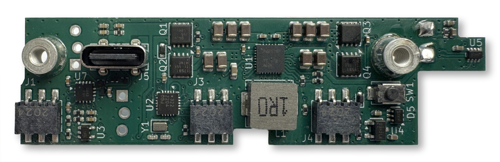
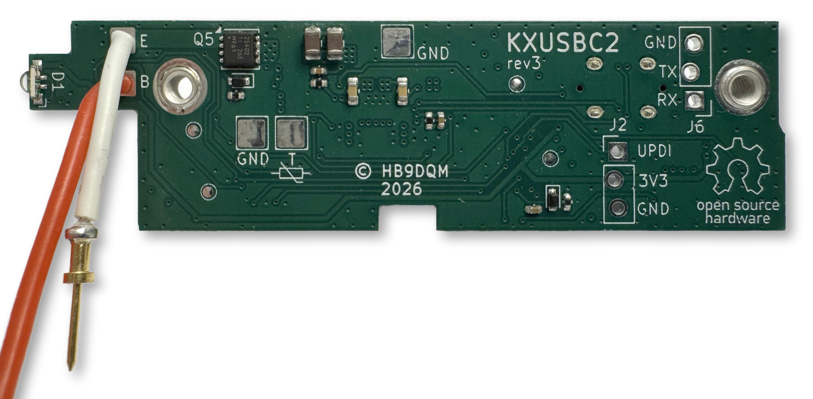
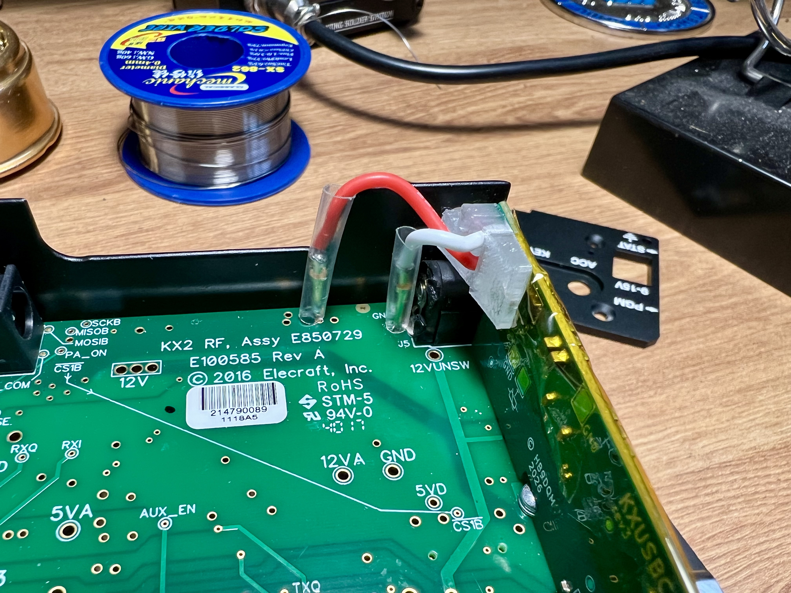
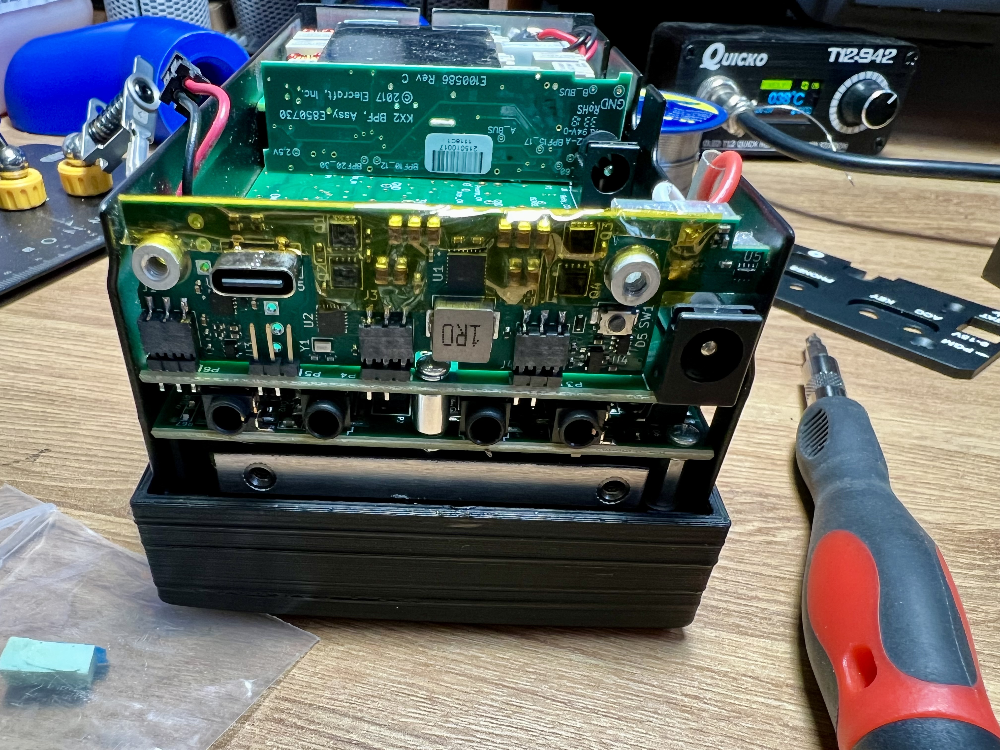
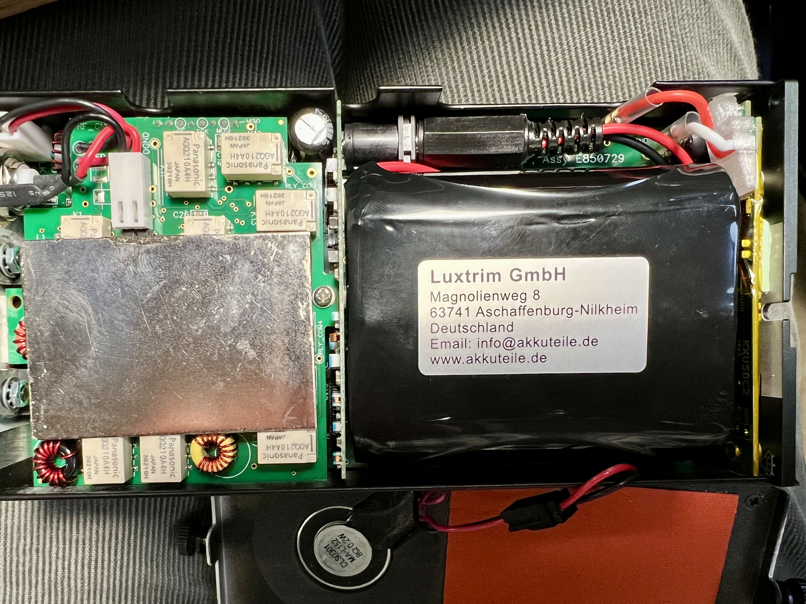
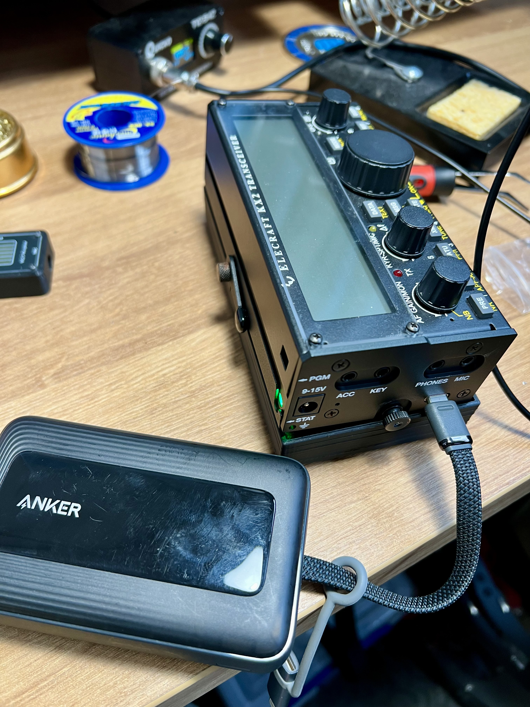

To charge my Elecraft KX2's battery, I have open the back and unplug the battery and plug it into the charger. Not a big deal but a faff, and as the speaker is attached to the back panel, I risk breaking its wires every time I do so. Elecraft sell a board (KXIBC2) that allows you to charge the battery from the DC input pin, but it's slow charging and quite an expensive board (what isn't expensive from Elecraft), so I didn't think it was worthwhile. Then I saw a post on the [SOTA forums](https://reflector.sota.org.uk/t/kxusbc2-internal-usb-c-charger-for-the-kx2-part-1/39683) about a board Manuel (HB9DQM) was developing, and wow! what an add-on.

 

Neil (G7UFO) put [together a kit](https://shop.g7ufo.radio/products/kxusbc2), where he's done all the hard work for you, soldering the components and sourcing the new end plate. I didn't buy one at first, as I wasn't sure it was really needed, but then my friend Fraser, [MM0EFI](https://www.youtube.com/@theradiorover), bought one and made a video on it. I was sold, and contacted Neil to buy one. Watching Fraser's video made installation look very easy, and it soon arrived and I had it installed.



It's always a tight fit inside the KX2, but everything goes back in. Maybe I should've trimmed some of the plastic sheaf around the pins, as they stand a little tall, but it's fine. Now I can charge the battery with USB-C at decent rates, and if I really wanted to, I can even charge my phone from my radio's battery now.

This is an exceptionally well designed piece of hardware from [Manuel](https://neon1.net/) and a great kit put together by [Neil](https://shop.g7ufo.radio/) (G7UFO). If you own a KX2, you need to [buy one immediately](https://shop.g7ufo.radio/products/kxusbc2)! Plus Neil's store has a nice collection of other items you might like.
