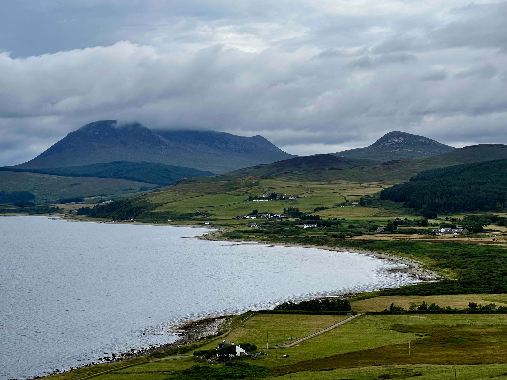
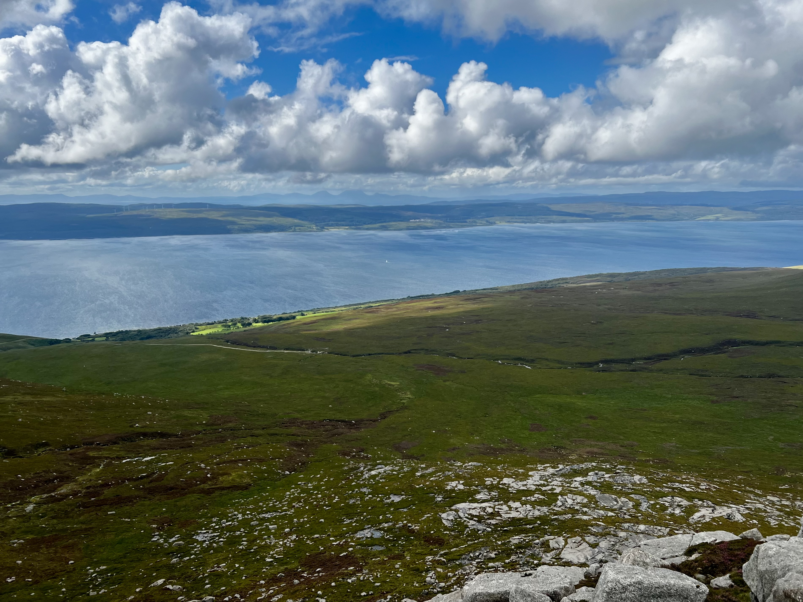
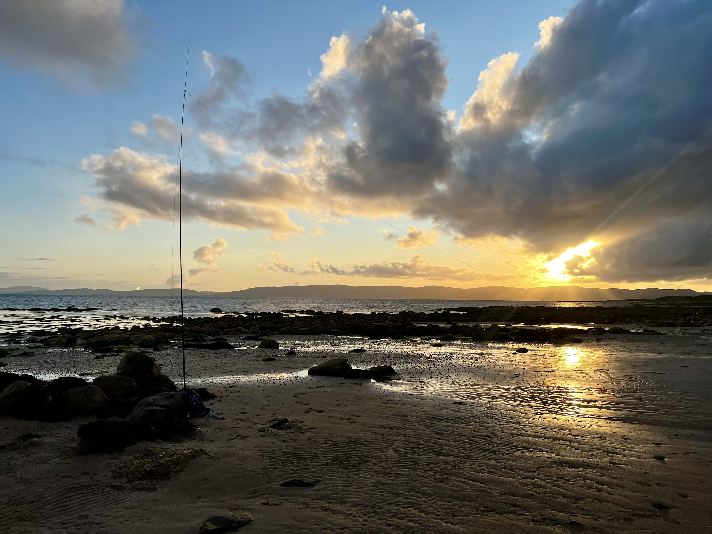
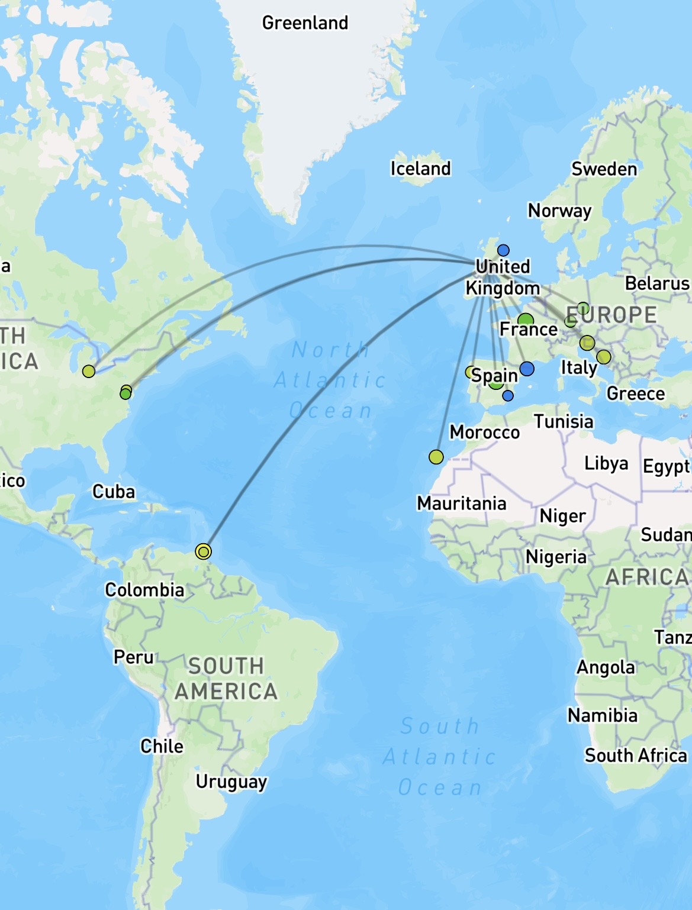
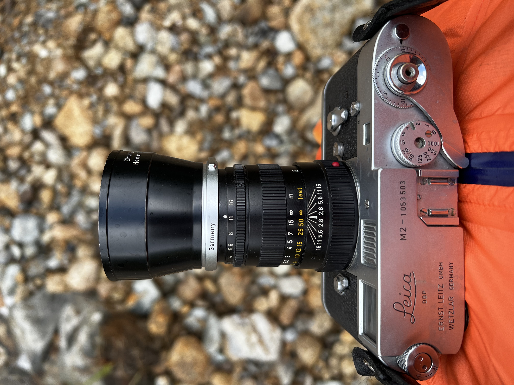

We spent a week on Arran, a family favourite holiday destination. As it’s a family trip, radio and hill walking takes a backseat, but we did plan one outing. My daughter and I would do Mullach Buidhe ([GM/SI-027](https://sotl.as/summits/GM/SI-027)) on the west side of the island, an 8.5 km round trip from Pirnmill - with a convenient corner shop for a suitable reward afterwards.

 

Weather in the week has been mixed but it was meant to be a nice dry afternoon, although quite windy.

 

The walk starts off going through some trees and ferns before coming out into a vast, and wet, grasslands. We made our way up the eastern ridge, with the intent to do the summit then come back down the western ridge to form a loop.

 

Unfortunately, at around 500m the wind was absolutely relentless and a struggle to walk it. After a little way and knowing it was another 200m+ to ascend, I decided it wasn’t a good idea to continue and so we turned back. We were maybe only 600m from the summit, but it’ll be there next time. It was a squelchy walk back, but the views were still good. We could see the three paps of Jura in the distance.

 

Not wanting to miss out on some radio time, I decided to setup on the beach in Blackwaterfoot. This happens to be in two POTA parks, GB-1447, Arran coastal way, and GB-4447, Arran Geopark (which seems to cover the entire island).

 

40m was pretty rough, and interestingly my 41’ random wire didn't tune on 20m - I guess the beach ground is different than a hilltop - but I had another antenna with me and used that counterpoise. However, the best band was 17m, with several US stations and a P2P with a couple on holiday in Trinidad and Tobago! I could hear Uruguay strongly on 15m, but they had many callers so I wasn’t going to be heard with my 10W from the KX2.

Aside from these phone photos, I only took film with me on this holiday…we will see how that decision turns out!

 
