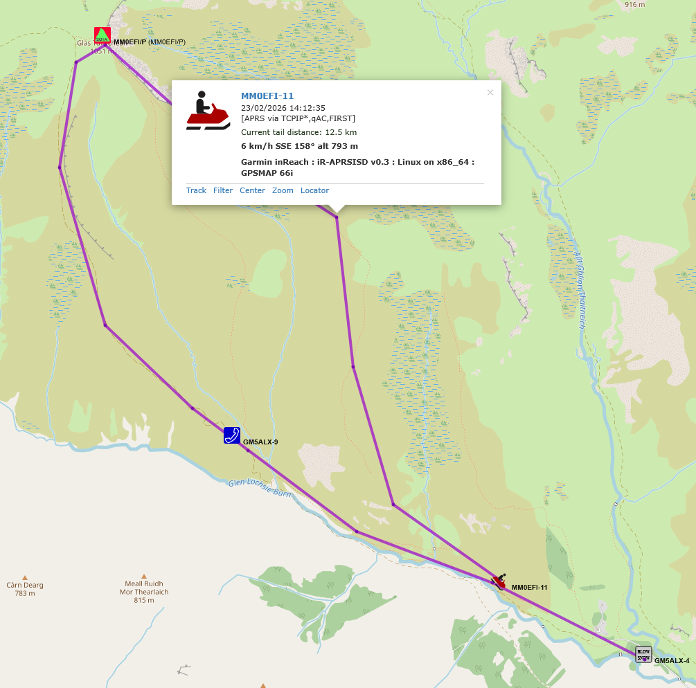
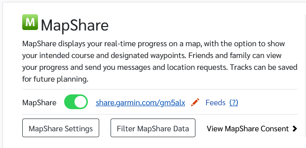

This is about software that takes your position as reported via Iridium from your Garmin GPS device and then relays it to APRS so you show up there.



It’s quite simple but has a couple of extra steps. This is for linux but it’s python based so will work on any OS.

There are a few results online but I went with this one: [iR-APRSISD](https://github.com/kemenril/iR-APRSISD). It has a readme with instructions which you should have a look at too.


## Download and install

Get a few packages - e.g. Debian, raspberry pi os…

`sudo apt install git python3`

Find a nice parent folder you want to keep it in and get the code.

```bash
git clone https://github.com/kemenril/iR-APRSISD.git
cd iR-APRSISD
```

Install `aprslib` python package in a virtual environment so as to not mess up anything else:

```bash
python3 -m venv .venv
source .venv/bin/activate
pip install aprslib
```


## The config

### Get your passwords

InReach is going to be your share username from https://explore.garmin.com/Social, plus the password if you’ve set one to view the MapShare.



To post to APRS you need a password which is based upon your callsign. Just go here to find it: https://apps.magicbug.co.uk/passcode/


### Edit config file

`nano ir-aprsisd.cfg`

All you need to edit is User and Password under [inReach]; SSID and Password under [APRS] and then pick a symbol. You don't need to change the URL but feel free to edit the comment.

Pick a nice symbol:


I found this nice image [here](https://blog.thelifeofkenneth.com/2017/01/aprs-symbol-look-up-table.html).

```ini
[inReach]
User		= Your inReach feed user
#If this is defined, we will authenticate to the inReach service.
# If it is not, we will assume public access is ok.
Password	= Your inReach feed password, if required

# This should be the location of your KML feed.
URL		= https://share.garmin.com/Feed/Share/%(User)s

[APRS]
#This SSID is used for logging into APRS-IS, and also as a base ID for
# generating callsigns for devices.  The first device found will be this
# SSID, the next will be this ID + 1, and so on.  If you define a [Devices]
# section, it is _only_ used for the login, and the device mapping must be
# given in full in the [Devices] section.
SSID		= GM5ALX-3
# If you don't have a password, you can use the --genpass command-line
# option to calculate it.
Password	= 1234
Port		= 14580

#If the separator is /, your icon will come from the primary symbol table.
# if it is \, it will draw from the secondary table.
Separator	= /
#This character represents an APRS icon from the table tied to Separator.
Symbol		= (

#This information is included at the end of each packet, along with some
# other data.
Comment		= APRS-IS KML forwarder, by K0SIN

#Define this section if you'd like to enforce an SSID to IMEI mapping.
# It must contain all devices you want to publish.  Anything without a
# mapping defined will be ignored if this section exists.
#[Devices]
#N0CALL-12	= 987654321987654
#N0CALL-15	= 987654321987656
#N0CALL-8	= 092847784398753

[General]

# Frequency in seconds with which to log packet forwarding stats to STDOUT
# If this is less than Period, stats will only be logged every Period seconds.
# Comment it out to skip printing packet stats entirely.
Logstats        = 300

# KML polling interval in seconds.
Period          = 300
```

Save with <kbd>Ctrl+o</kbd> and exit with <kbd>Ctrl+x</kbd>
Run it

Best to run on a server that’s always on, or on when you want it working. There are many ways to do this with supervisor programs, systemd services etc., I like `tmux` (terminal multiplexer) as I can resume my session whenever and see the output and my past commands plus have a terminal per activity.

If you want `tmux` then install it, run `tmux` and activate the virtual environment `source .venv/bin/activate` and run `python ir-aprsisd` to have it load. Disconnect from tmux via <kbd>Ctrl+b Ctrl+d</kbd> and rejoin tmux again via `tmux attach`.

For a set and forget, a `systemd` service is probably best. It’ll run each time you turn the computer on automatically.

Make a new one:

`sudo nano /etc/systemd/system/ir-aprsisd.service`

Add this text, adjusting user, group and folders as necessary:

```ini
[Unit]
Description=ir-aprsisd Service
After=network.target

[Service]
Type=simple
User=alex
Group=alex
WorkingDirectory=/home/alex/dev/iR-APRSISD
ExecStart=/home/alex/dev/iR-APRSISD/.venv/bin/python /home/alex/dev/iR-APRSISD/ir-aprsisd
Restart=on-failure
RestartSec=5

Environment="PATH=/home/alex/dev/iR-APRSISD/.venv/bin:/usr/bin:/bin"

[Install]
WantedBy=multi-user.target
```

Get it running:

```bash
sudo systemctl daemon-reload
sudo systemctl enable ir-aprsisd.service
sudo systemctl start ir-aprsisd.service
```

Check for errors, and past them into ChatGPT 😅

`sudo systemctl status ir-aprsisd.service`

## Finally

By default it polls the Garmin share every 5 mins but you also set your Garmin reporting frequency on your device. A 2m/70cm LoRa tracker will give you much more detail but sometimes you don’t always have igate coverage. Plus if you’re running the Garmin tracking anyway, why not report to APRS.

It throws a syntax warning about `\w+` that line is used for multiple inReach devices so can be ignored. Maybe someone will do a pull request to fix it 👀.

No doubt better ways to do things!
