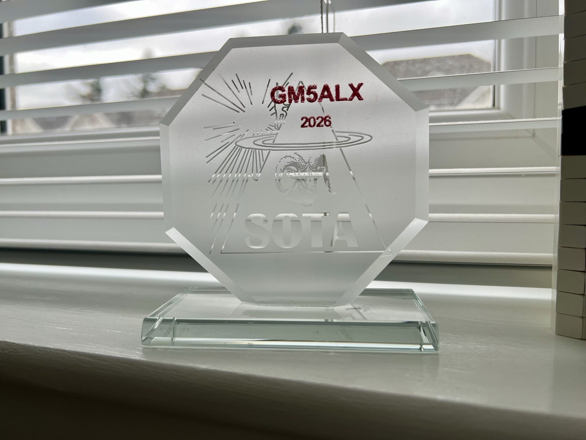
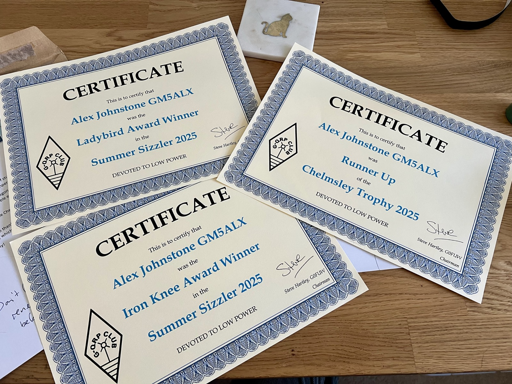

After my [mountain goat activation](https://gm5alx.uk/sota/2026/mountain-goats/), I wanted to get the glass trophy. This is probably the only award I've actively chased, and certainly the only one I've paid for, but I've seen Fraser's and it looked quite neat.

It arrived very quickly and now it sits on my window ledge next to the computer.

Then the next day a rigid envelope arrives and it's full of certificates from G-QRP! I'm not really chasing awards but I try to submit my logs when they do events, one of which was the summer sizzler, and the other a 2025 award - the Chelmsley Trophy.

The summer sizzler happened to be over the week when I did 8 big GM/ES summits, including the trip of Cairn Toul and Braeriach (the second and third highest summits in GM/ES and the third and fourth highest mountains in the UK). I did them back to back with another long trip out to Bynack More from Braemar. A total of 85 km across two days! Probably why I won the iron knee award!
