There are lots of hills in Scotland, but not all of them are SOTA ones - those have to have a prominence of 150m over the surrounding hills. They can be some of the highest peaks in the U.K. but still not be SOTA. Two of which are the Munros Mayar and Driesh. These are fairly near me, accessed from the east and are a popular spot for those looking to climb a big hill.

 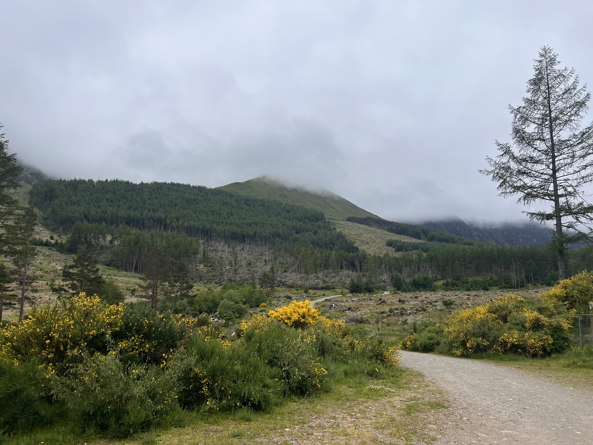

Whilst they aren’t SOTA summits, they are HEMA summits (ones with prominence 100-150m) in multiple parks and a fauna and flora site (WWFF) - there are schemes for everything! My plan was to walk both Munros and then activate at Driesh before heading back to the car. Driesh has a trig point and people collect those as well.

 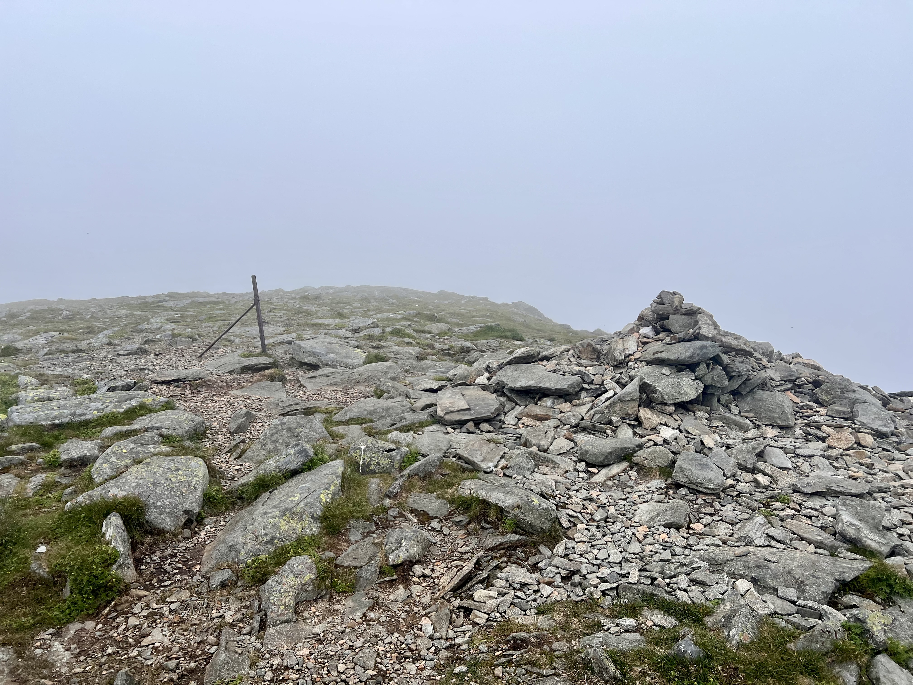

The route is very defined and a popular one so no surprises that the car park was busy and I saw a few folk out. The weekend had been glorious sunshine but today it was overcast and risked rain. I don’t mind that but it was very humid with lots of flies until you got up onto the top, where a little breeze help both situations.

 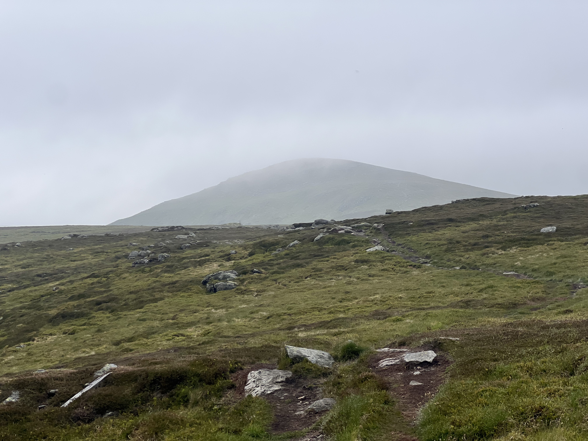

A quick photo at the top of Mayar and then on to Driesh. Mostly in the cloud at this point although did get a bit of a view down Glen Prosen. Top of Driesh has a nice shelter and trig point, which would be ideal to sit in. However, with a few other folks out, I found a spot to setup away from the top.

 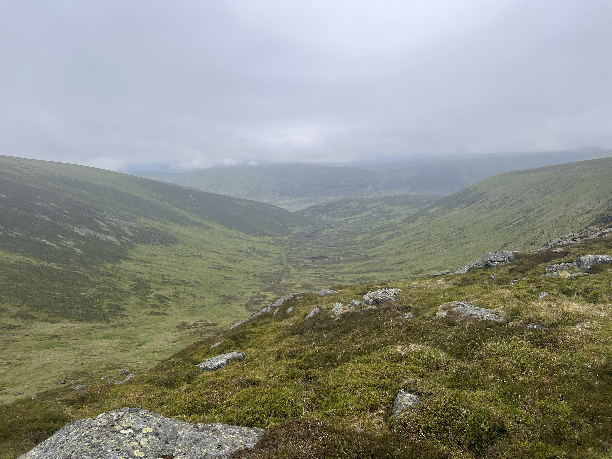
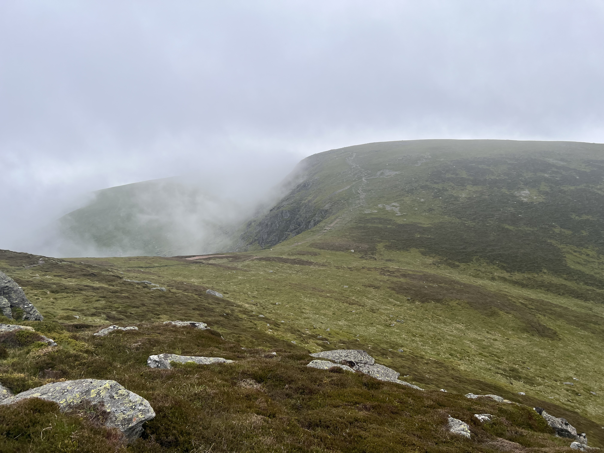
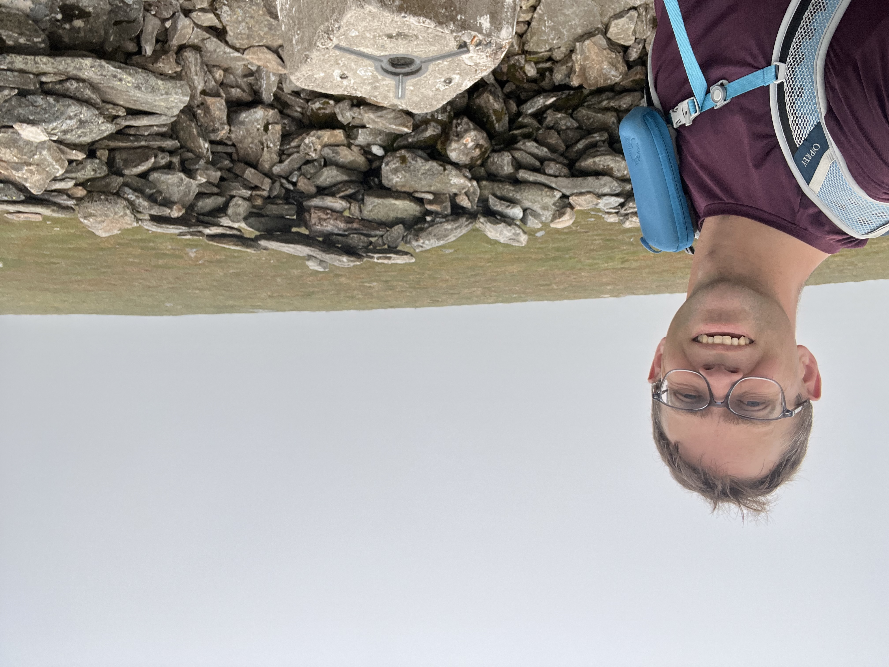

With the PoLo app, I can add all the POTA, WWFF and GMA references and it will spot to all the sites. Very handy as, other than POTA, I’m not sure how I spot elsewhere! Starting on 40m is a bit slow but callers do start coming back to me. I make it up to 11, enough for completing the POTA requirements, on 40m before I move to 20m. I did think about packing up then but it was still dry and I thought I’d give it a go. 20m was pretty busy, not huge pileups, but a steady stream for a good number of QSOs. WWFF needs 44 contacts to activate and whilst I thought I’d never get there, I ended up being quite close, with 37 in the log. At this point it started to rain and I’d been at the top for a while, so time to pack up.

 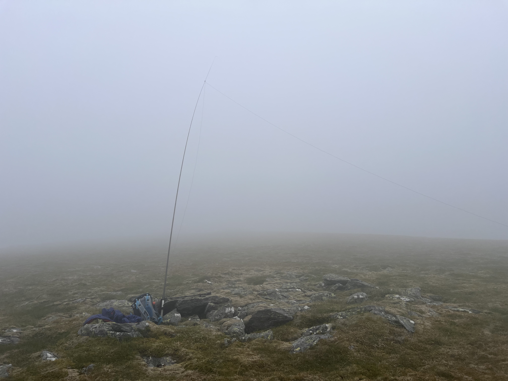

The route back is straight forward and offers a nice view towards Tom Buidhe, another non-SOTA Munro near Glenshee (that I also need to climb at some point).

 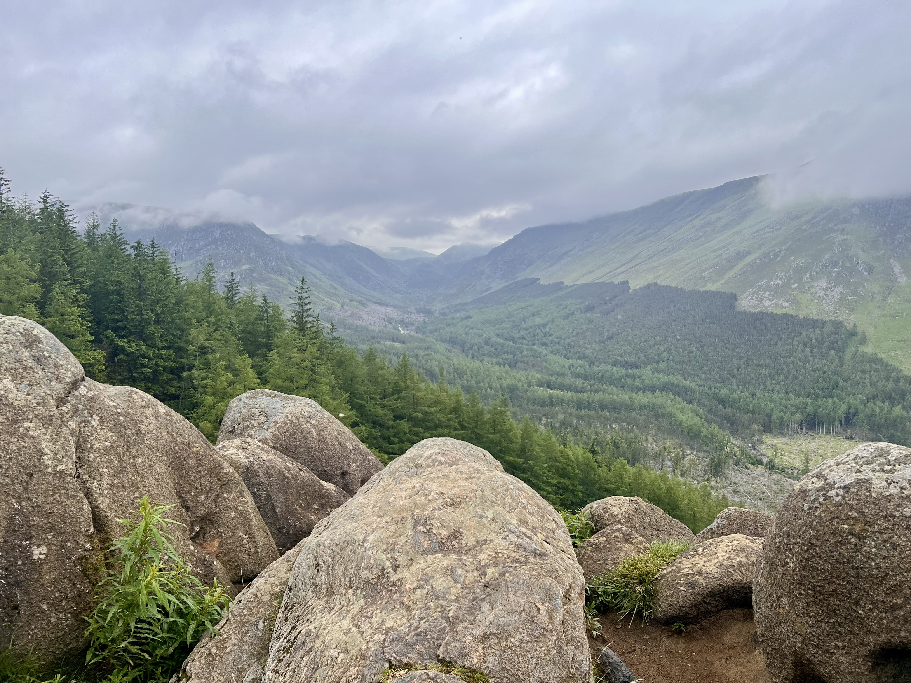

This now puts me on 62 Munros climbed (out of 282!) and I think this is my first POTA only activation. Still just as fun as SOTA, although still a shame it doesn’t count as one! Whilst I didn’t get 44 contacts for the WWFF, they allow me to combine previous activations to get to 44, and as this one is quite large, I’ve already activated in it on previous summits this year, so I’ve sent in my log for both to get to 44.

 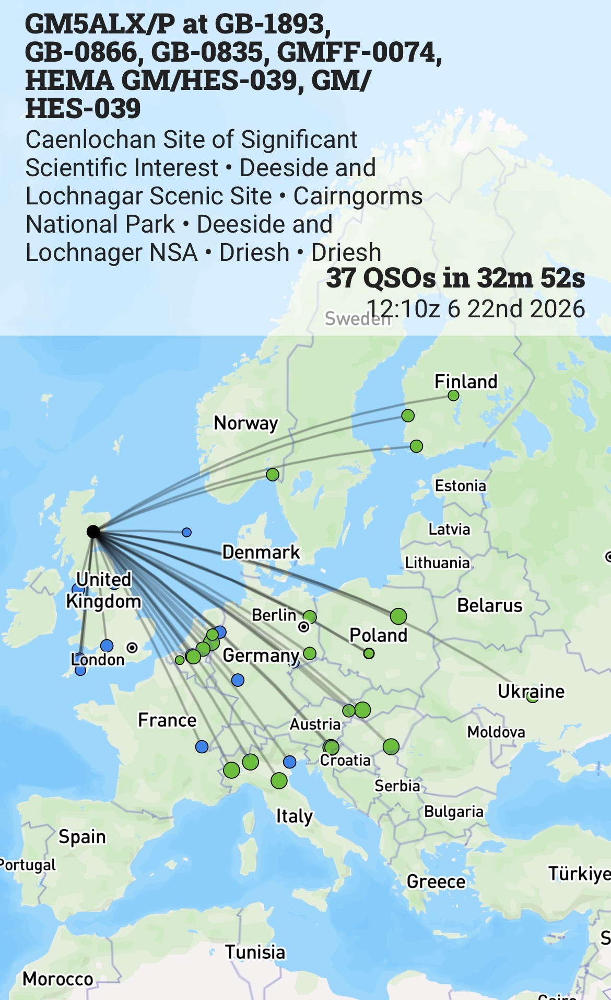

I also took my M2 with me on the walk. I’s started a roll of Ilford Ortho 80 over the weekend, and thought it would be good to use the rest of the roll on my walk. I actually ended up using more frames than I thought and it didn’t last the whole way. If I can find my development bag, maybe I’ll develop them myself, and eventually see how they turned out and what Ortho 80 looks like.

 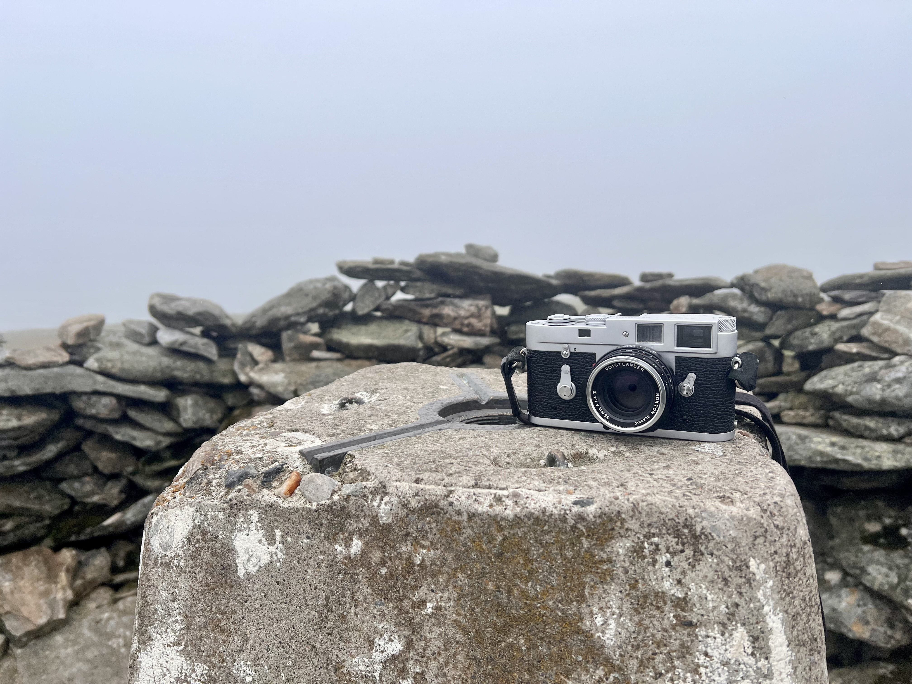

Finally, one of the holiday houses near the start looked very well adapted to avoid the need for expensive oil/LPG and is fully electric

 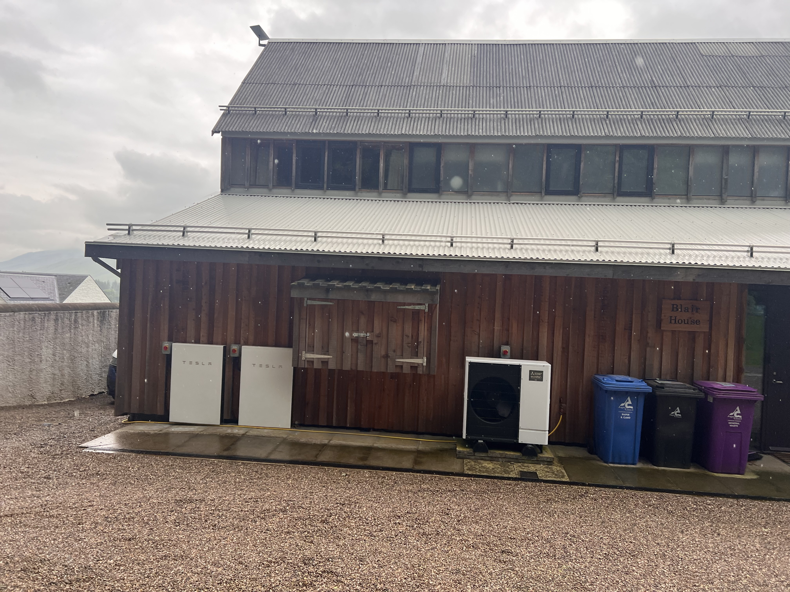
