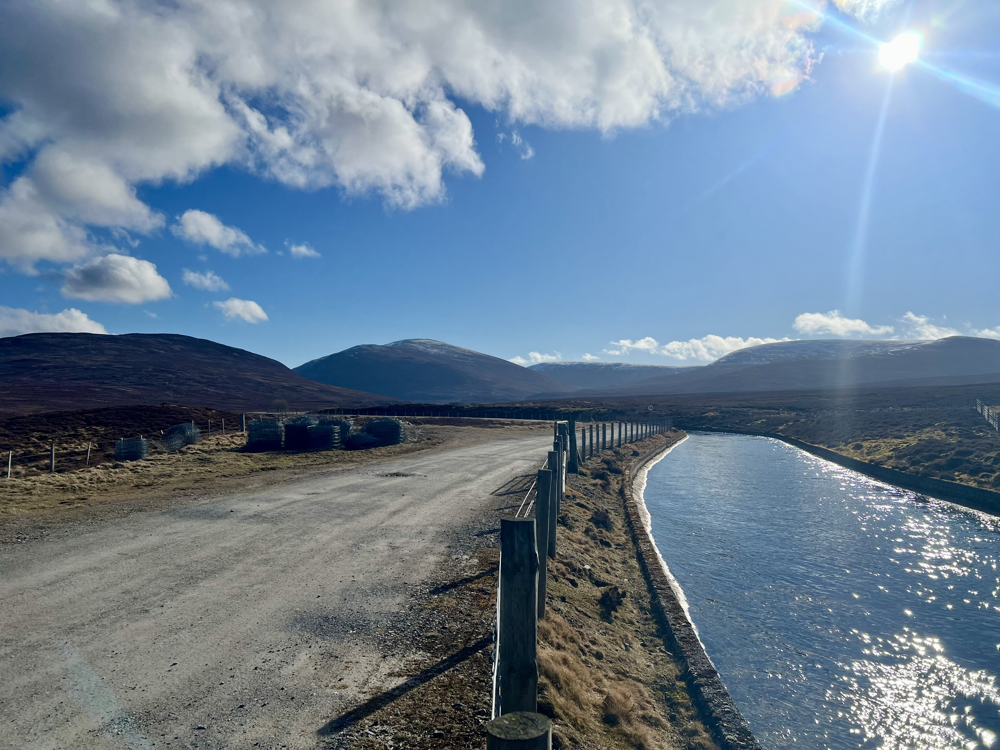
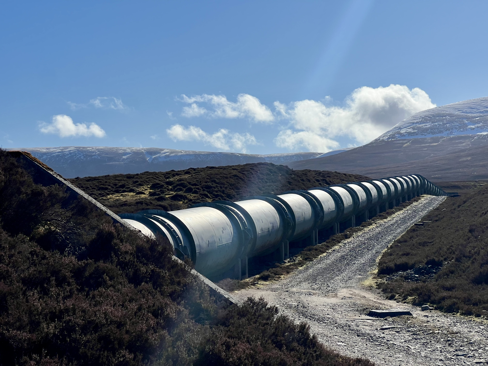
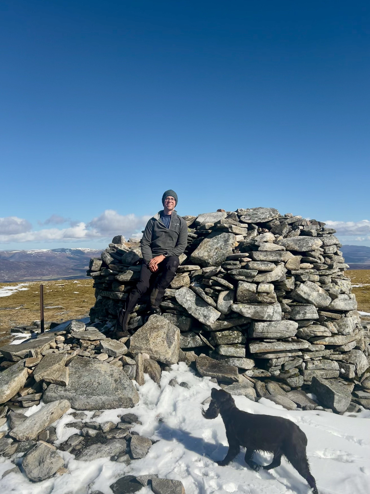
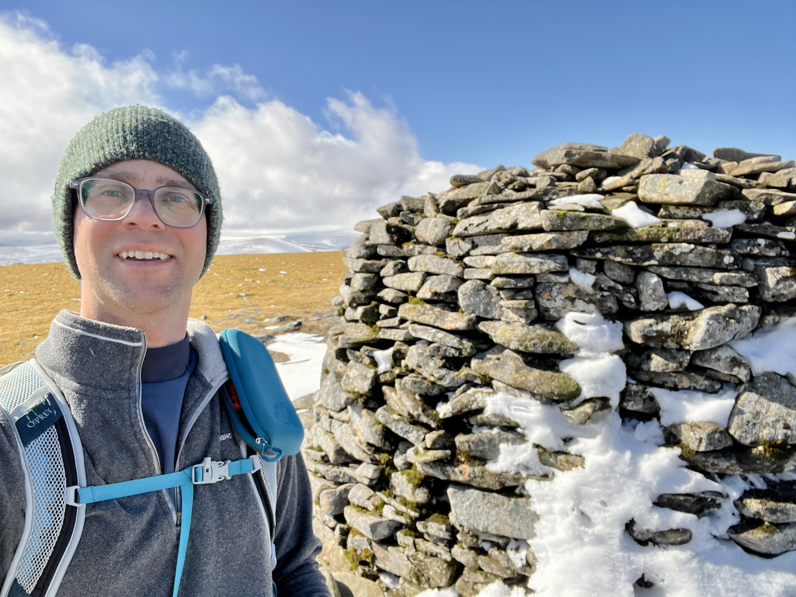
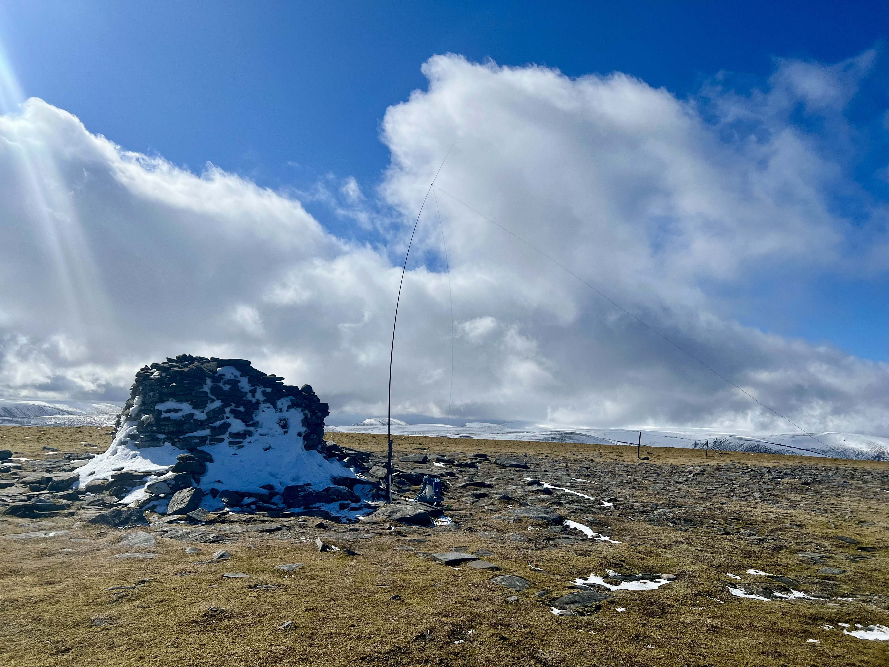
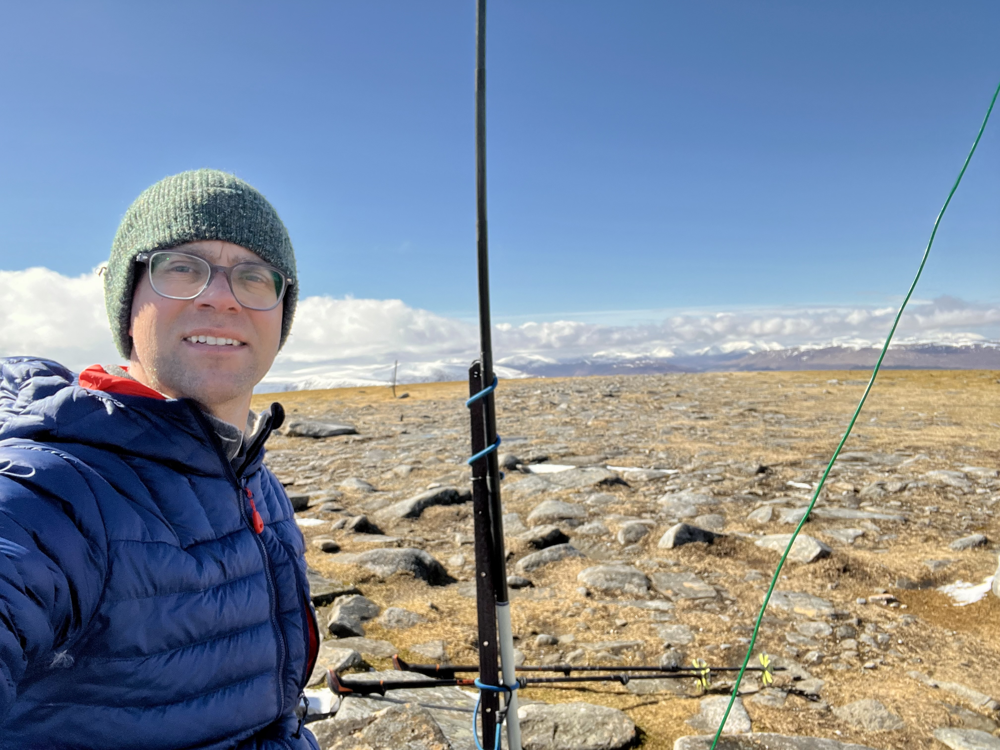
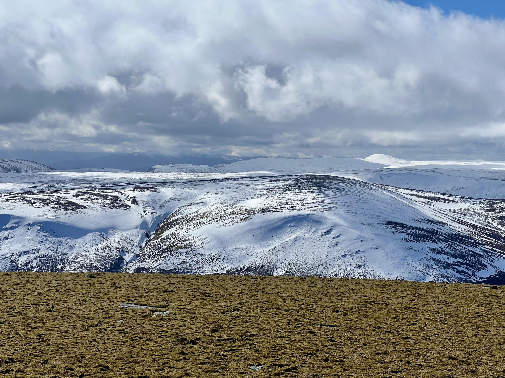
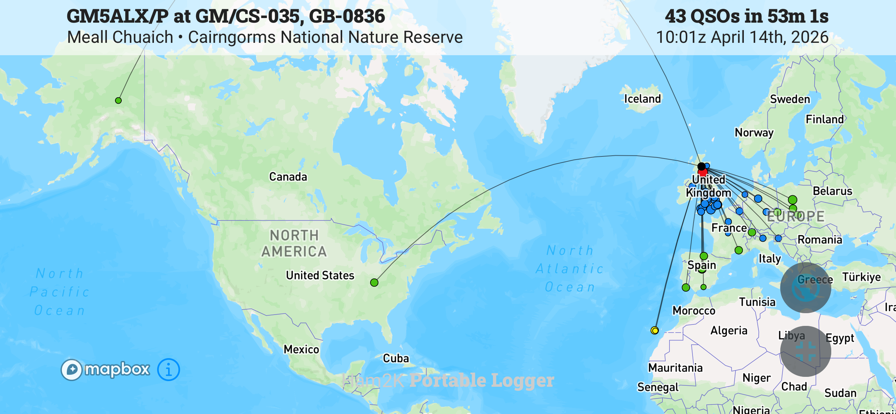

This was my last Munro on the east side of the Cairngorms National Park to activate. The forecast was for sunny spells but it ended up being a glorious day. The wind did get up at the top, and it was very cold. 

The route is pretty standard, and being an easy Munro, is often busy - you can tell when you drive along the A9 and suddenly see one lay-by full of cars. There were about four cars when I arrived. The first part of the walk is along a road track leading up to a small hydro power plant. There’s a nice aqueduct running alongside and you get a good view of the hill you’re about to climb. 

The track is fairly flat but when you get to the hill then it’s a constant climb to the top. Boggy in places but an otherwise straightforward. When I got to the top, two women and their dog were doing selfies at the top. We exchanged taking photos of each other and after a few minutes they were off. 

The big cairn is nice to hide behind out of the wind and a convenient fence post makes an easy mast support. There was a tiny bit of snow behind the cairn but the whole summit was bare. Compared to the two Munros to the South (which I did last week) which still seemed to have a lot of snow on them. 

I setup the KX2, the 41ft random wire antenna and was on the air. My drive and walk were much quicker than I expected and so was on an hour before my plans. My friend Denis, MW0CBC, was also out a bit further south in Scotland but we didn’t manage to make any contact. His weather wasn’t quite as nice as mine so he didn’t hang about long. 

Recently, I’ve been spotting myself on both SOTA and POTA (assuming i’m in a park- but anything in the Cairngorms is in at least one park), and that seems to bring in a bit of a bigger crowd. Seems some people only chase POTA, not sure why but there we go. The hams2k PoLo app makes it easy to spot on both places. I need to check but I think I might’ve been in two or more parks but only spotted one. 

I had a good run on 40m and then moved to 20m. Had a US station come back absolutely booming 59+20dB - his profile says NY but his locator info put him in Kentucky on my logging app. Then Alaska returns my call! [AL7KC](https://www.qrz.com/db/AL7KC). I did think AL was Alaska but at the time I wasn’t sure, it was only a little later when the contacts had died down did I check the map. My first Alaskan contact! 6,100 km! Although interestingly the “Kentucky” contact was also 6,100km - I guess the world being mostly a sphere causes that.  

I spent a good 45 minutes on HF, my fingers were cold and I decided it was a good time to pack up.  Just as I had finished two more people appeared at the summit, so that worked out well for everyone. I’d just started heading down when I saw Ross, MM1ROS, spot on 2m on a hill in southern Scotland. I stopped and got out my HT and he was a strong signal, and we had a quick chat for our summit to summit. Using the radio without gloves, my hands were then freezing cold, so back in the gloves and back down the hill. 

On the way down, I wondered if I had time to do another summit. Make the most of the nice weather and the cost of diesel to get here! There’s a small one outside Kingussie, that only takes about 30 minute to climb. However, it was a few km back along the track to the car and I had to be home in time for swimming lessons. It was going to be tight and I didn’t want to spoil a nice day by being in a rush to get home. Maybe if i’d taken a bike to cycle the first part I could’ve.

A great day out, and another summit off my Cairngorms list! 

