After the first one this year, which we called off due to the weather (although a few of us still went out), we had a second attempt at a GM/ES day out. The weather was much better, and by much better I mean, absolutely outstanding! It had actually snowed the night before, and the snow gates were shut in the morning, so a couple of folks changed their plans as they were coming up from the south.

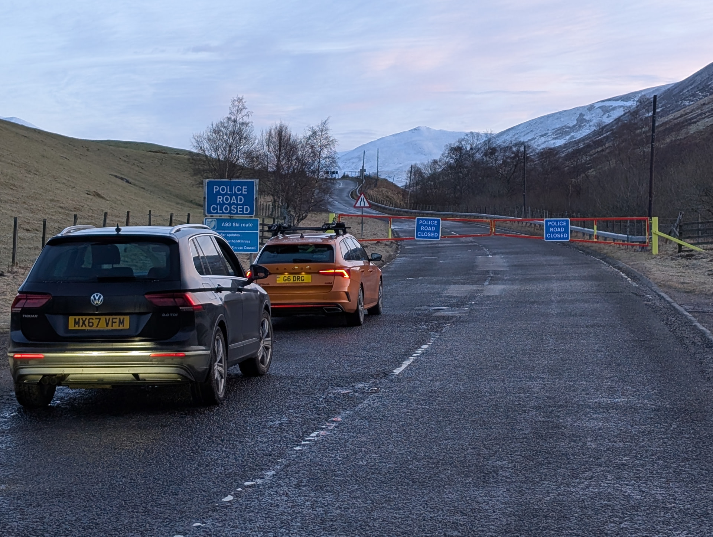

I was back on my previously alerted (non-ES) summit of Morrone, GM/CS-060, which is just outside Braemar and has a nice path up to the summit. I had to do the school drop off first, and so I wanted something quick to get to the top to and join in with everyone else.

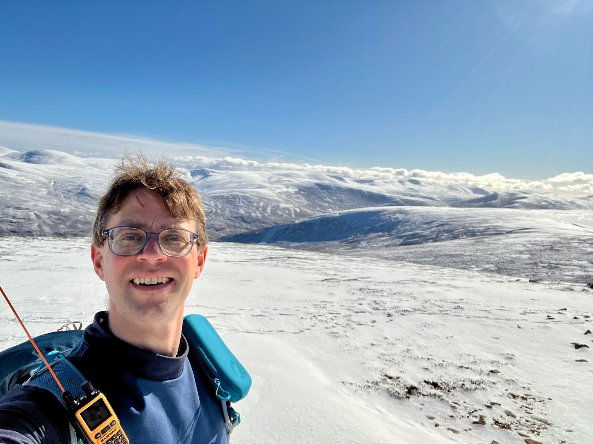

As I walked up to the top, I heard others starting to call on 2m. I worked a few with our SOTA club call, GM0ESS, and whilst Fraser, MM0EFI, was working Paul, G4IPB, I managed to get into the AZ to then start using my call for S2Ss. In no time at all, I had four 2m S2Ss, although I missed Gavin and Andy who were in the Angus hills, as they'd already left to start the journey up to meet us for lunch. Shame, as Gavin was on Monamenach (GM/ES-028), and no-one goes there! Given all the planned activity, I'd brought the IC-705, together with a little 2m amp I picked up on ebay a while ago, and thought I'd try some 2m SSB.

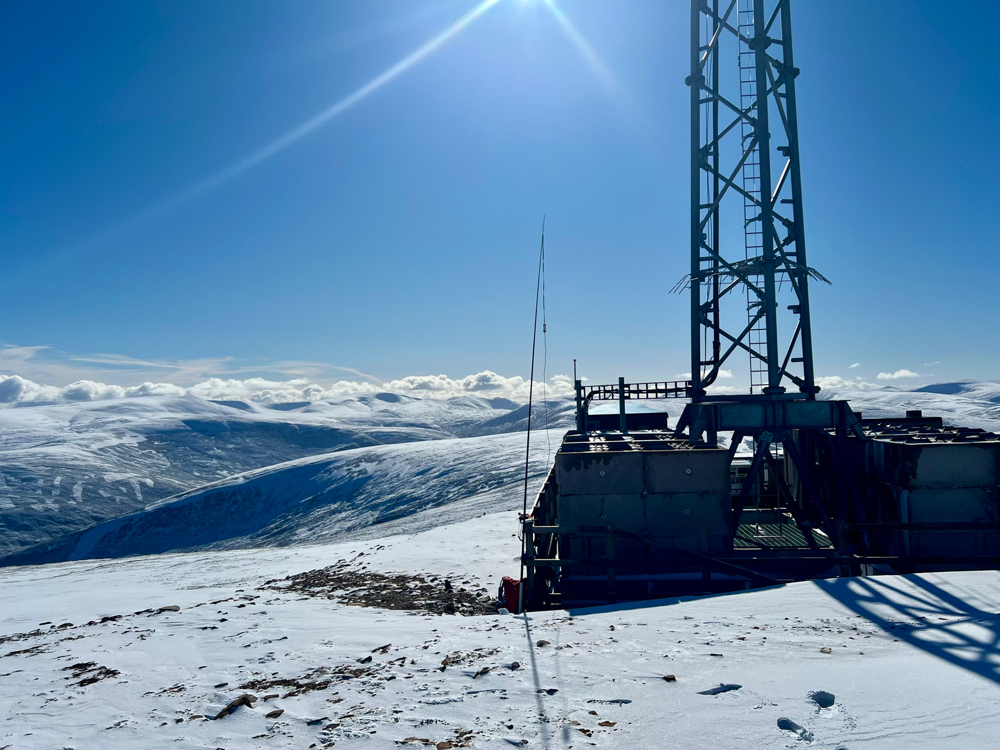

I was using the slim G for the antenna, so vertically polarised. After 15 minutes or so, I had 3 QSOs on 2m SSB, and decided that would do. Flicking back to FM and a few more S2Ss, this time with a few folks down in SS land. My amp, Tokyo Hy-Power 25W (or 35W?), helped to get my signal back into Aberdeen for a couple of locals.

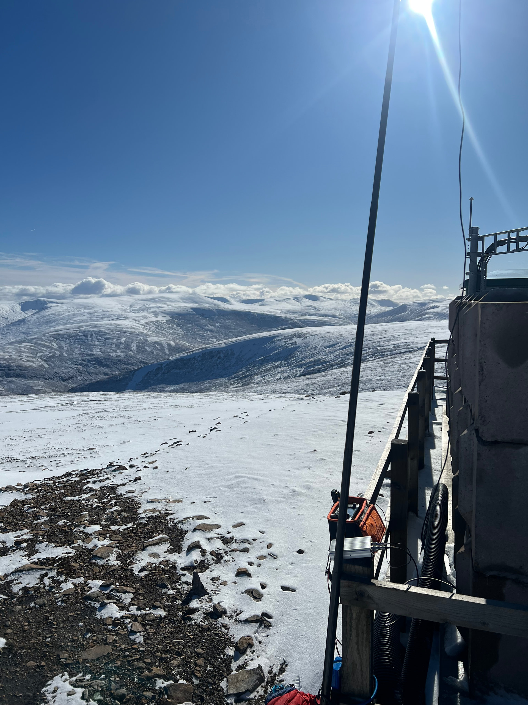

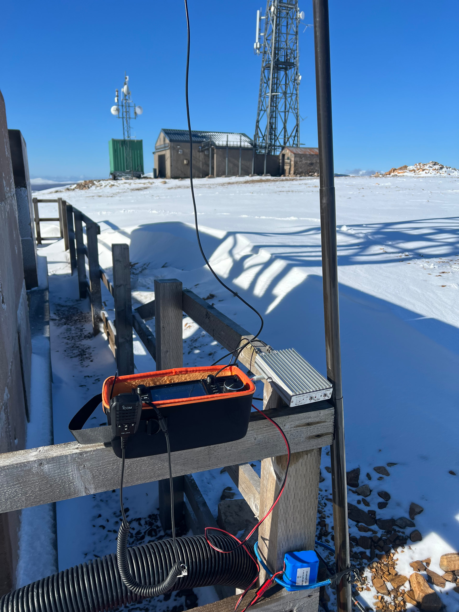

I'd tested the amp at home when I first bought it. I'd stuck it on FM and then measured the power and all was good. When I tried SSB, I noticed the SWR was really high and that surprised me, but I didn't really know what the issue was. I checked the connectors and they were fine, I did wonder if I wasn't understanding the 705 properly as it's been a while since I used it (although it's so nice to use compared to the ft-857's menu!). I did make a few contacts so it was working. When I switched to FM, and set the amp to FM, I then heard the relays clicking and the SWR was just fine on the radio. So I don't think it was working properly on SSB, and I was probably only putting out 1W via the RX route on the amp! Would've been better just bare 705 with external battery for 10W! I've not tested the amp back home yet to see if the issue is still there. I partially think that the rf sensing isn't quite working, or the 705 reacts to the high SWR of the RX circuit and cuts the power to 1W faster than the amp can trigger.

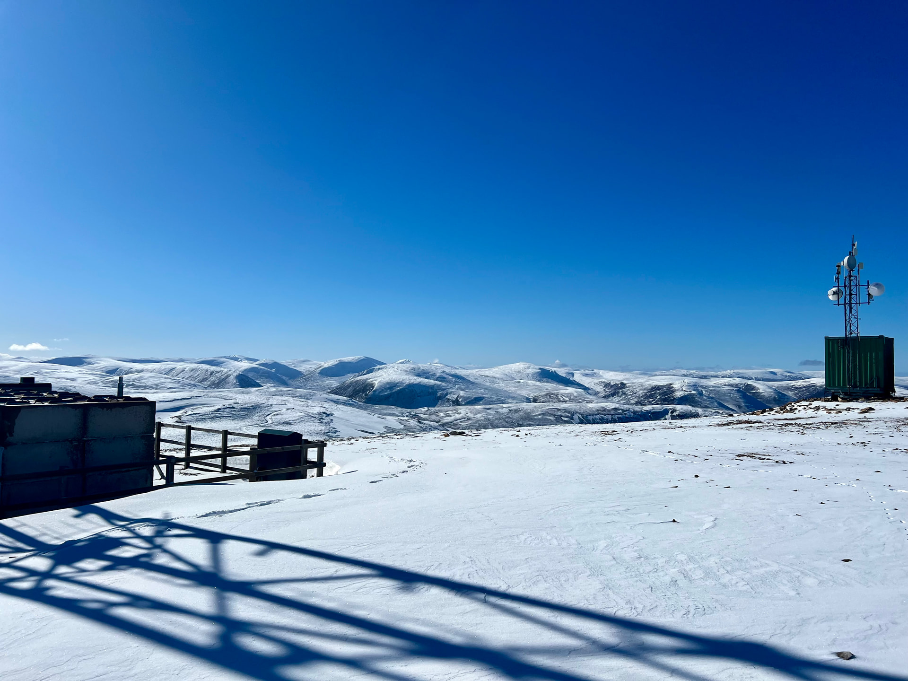

I know with my SG-3000 remote ATU, the 705 can't trigger it as the SWR protection limits the 705 to 1W and that's not enough for the ATU, vs. using my ftdx10 which will still put out 10W on high SWR that then triggers the ATU to tune. Be interesting to test if setting it on FM mode works better than SSB mode, or maybe I need to venture into some mod to add PTT trigger...I did a quick internet search but the solution wasn't obvious.

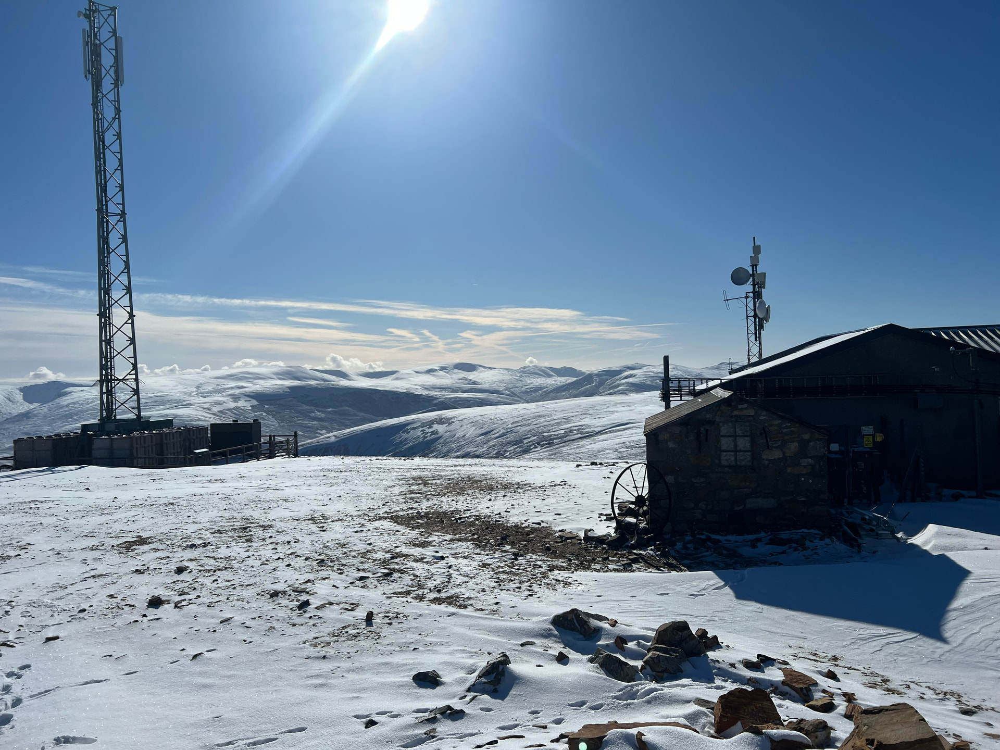

I also brought the remote ATU for the 705 (not the icom one) that came with the radio when I bought it used. This tunes up a long wire. I set this up with my usual 41' wire and it tuned up on 40m just fine. It was getting on for 12:30 and we were meeting at 1pm, but as it was such a nice day, I thought I'd try 20m as well. The ATU didn't like my length of wire for 20m and it wouldn't tune. I have the wrong counterpoise length since my last one broke and I just used a random bit I had lying around with a connector on it. I can get away with it on the KX2, SWR of about 2.8:1, but this tuner wasn't having any of it. I'd already spotted (this was also a three park POTA and so PoLo had spotted me on POTA as well as SOTA), and I heard several stations give me a call, and then some Spanish ops talking to each other about how they'd not heard me - or something like that, they were talking in Spanish!

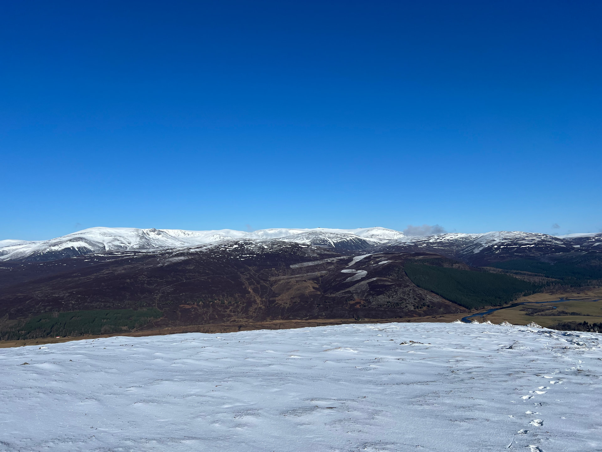

Probably it was for the best, as I needed to pack up and meet everyone, as I also had to do school pick up today. The whole time, I didn't need a jacket, it was so warm in the sun and my jog down the hill resulted in a very hot arrival at the Bothy for lunch. Paul was with his dogs, so they were sat outside, and I joined them in my T-shirt!

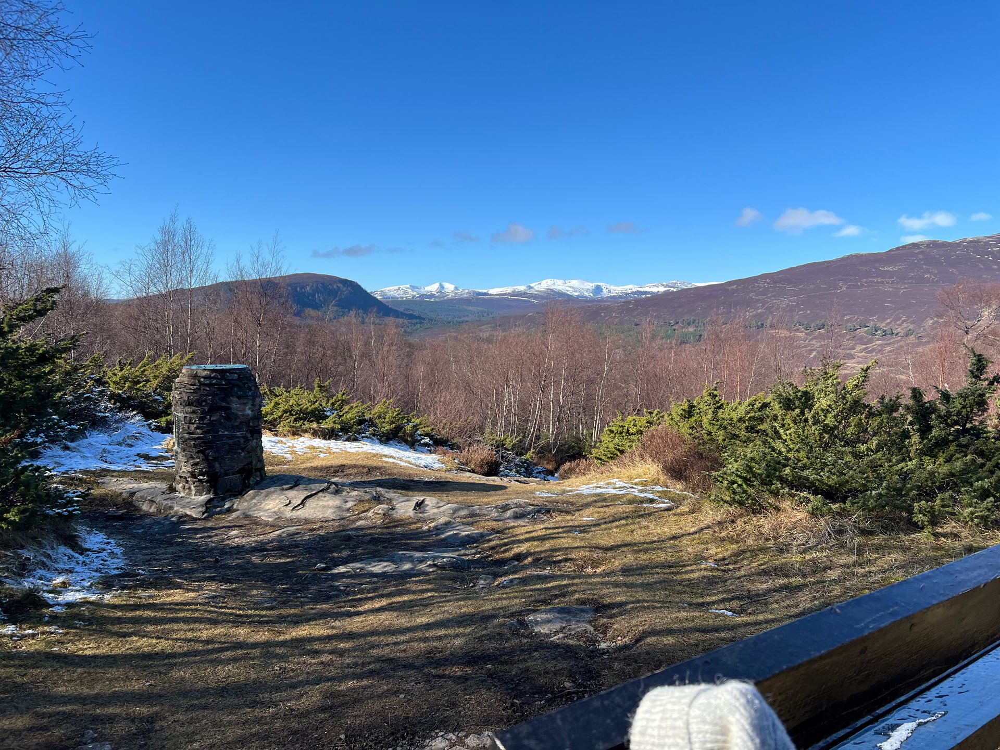

We had a good chat, and everyone slowly joined us from their summits. Met a couple of new faces, which is always nice. Tim and I had made some stash for the event. I had some badges made, and Tim had printed some limited edition coasters!

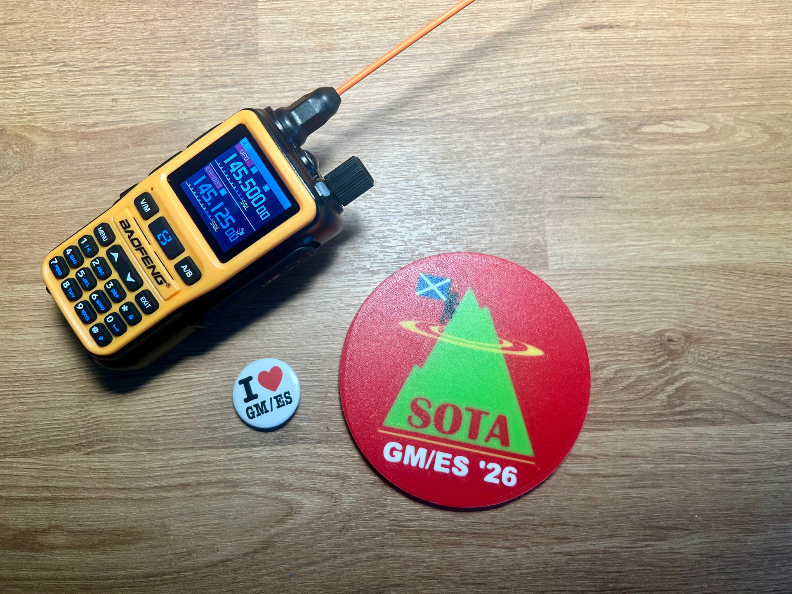

I had to shoot off to do the school pick up, but the others continued on for a while longer. Several folks were staying locally for the weekend to do some other hills. The weather was very nice the rest of the weekend, but Friday was the peak. Seems we did well again, given [last year's](https://gm5alx.uk/sota/2025/gm-es-025/) one also had ridiculously good weather.

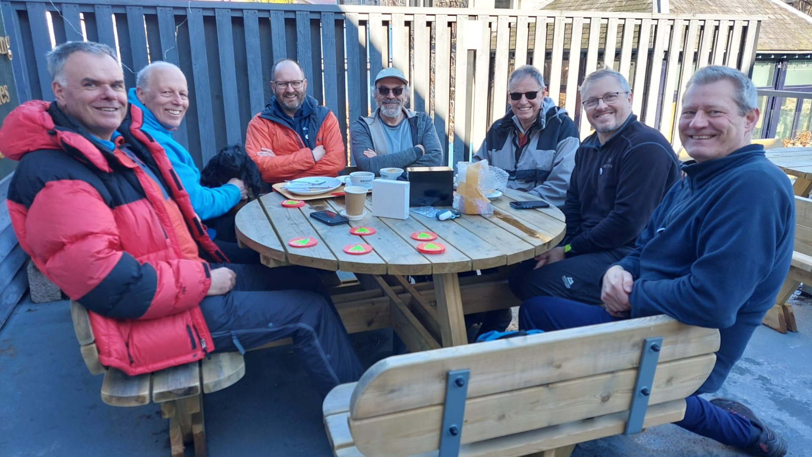

Also on the [reflector](https://reflector.sota.org.uk/t/spring-gm-es-activity-day-6-march-2026/40227).
