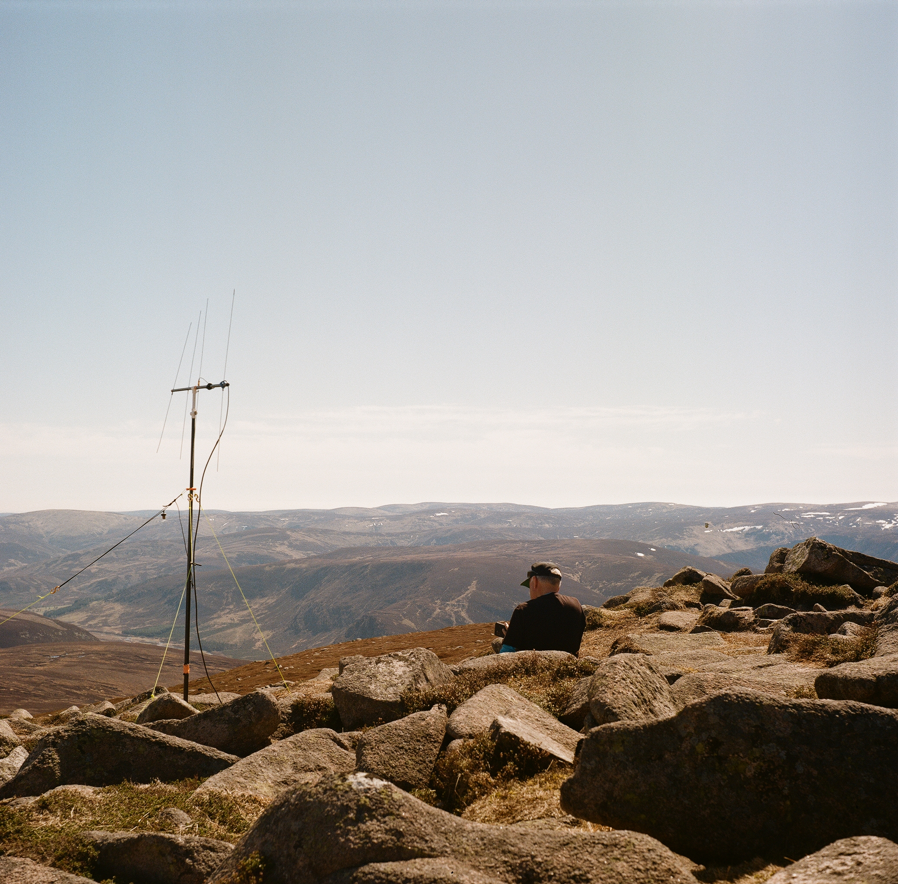
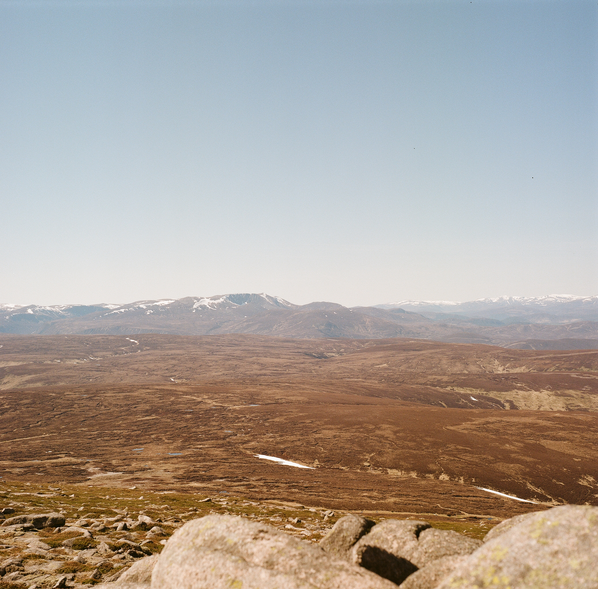
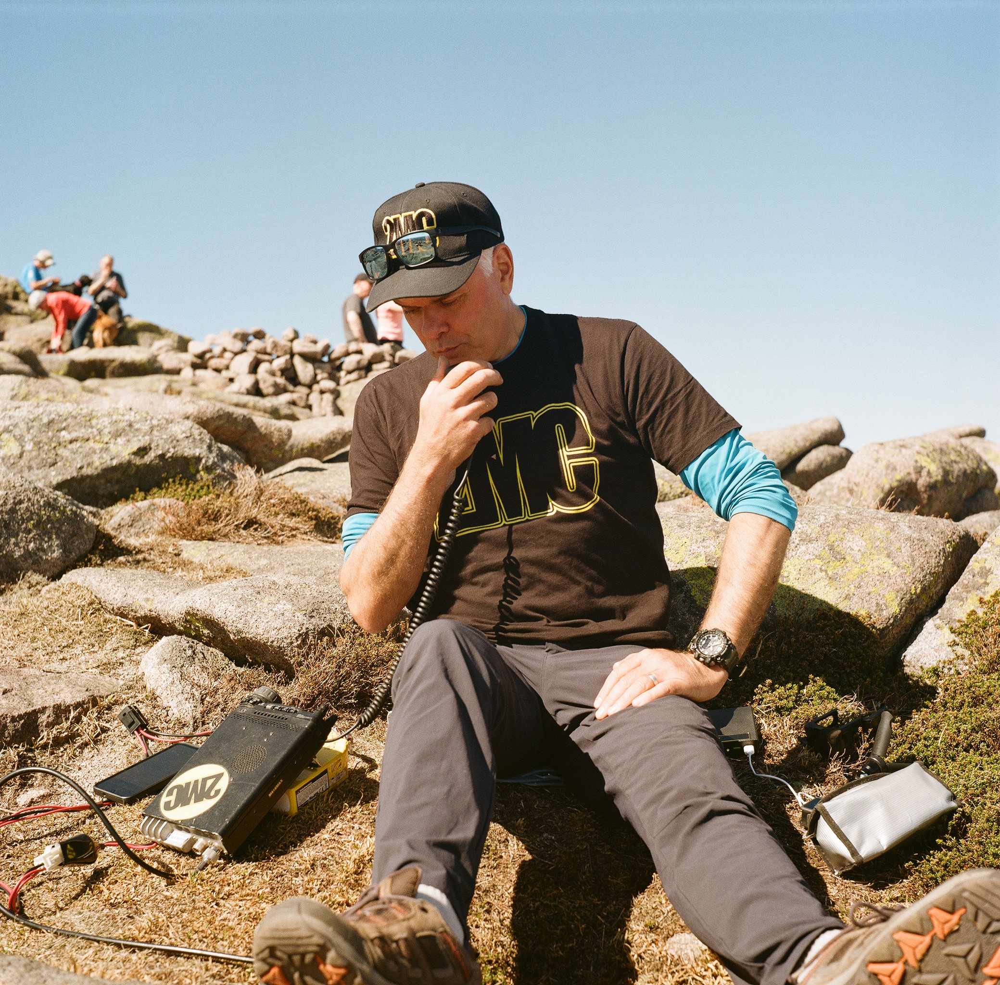
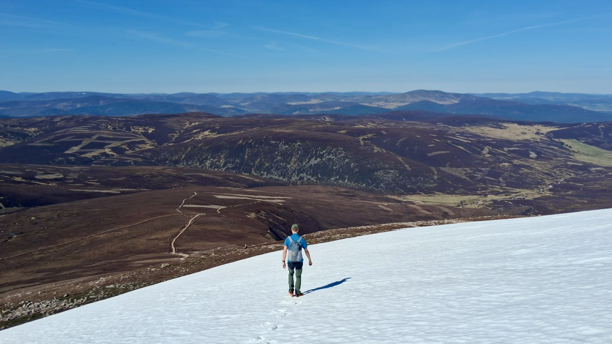
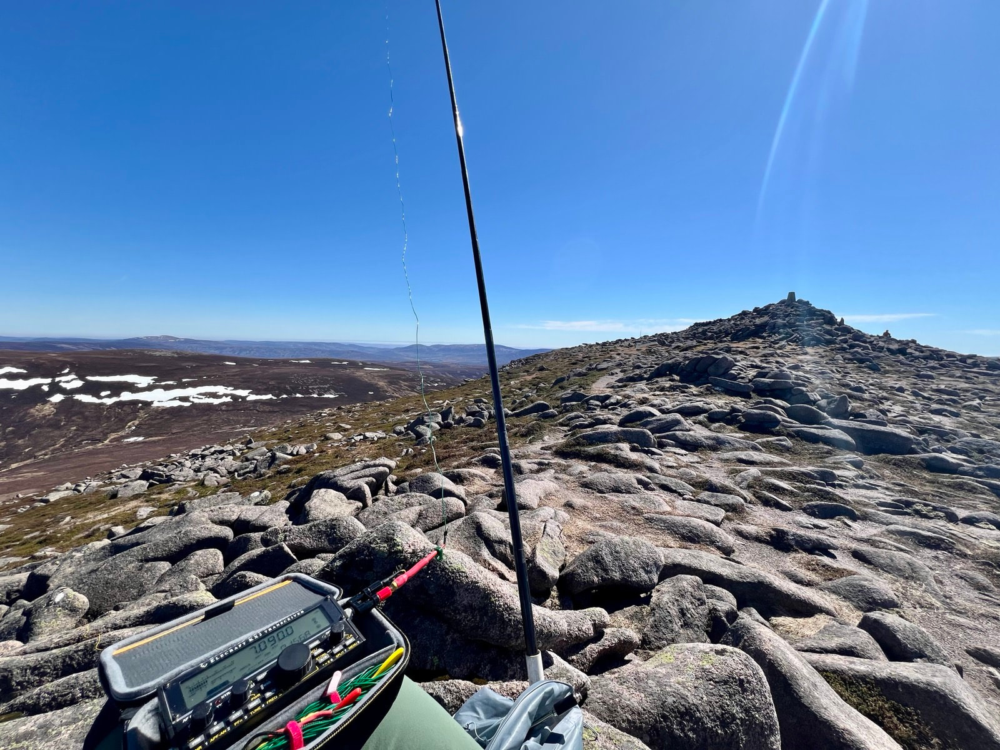
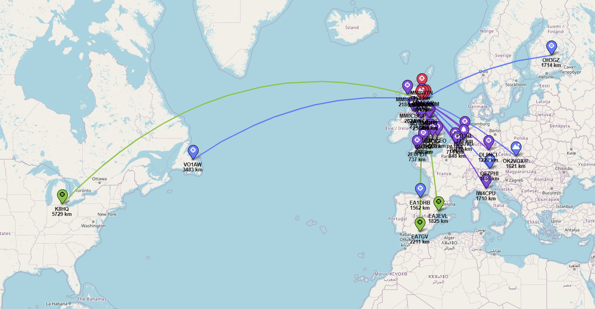

Inspired by a thread on the [SOTA forums](https://reflector.sota.org.uk/t/the-twist-i-didn-t-expect/39622), I decided to take my Ricohflex TLR with my on a SOTA activation. It helped it was a lovely day, and I certainly wouldn’t have taken it if it was raining!

 

I found a roll of Kodak Gold 200 that I had in my film box in the garage. It was my only roll of 120 and was left over from when I bought some when Gold 120 came out in 2022 ish. It had expired, 2024, but not by that much and whilst not kept in a fridge, it has been in the garage, so not exactly warm.

As a bright day I was going to use sunny 16, but I also couldn’t resist using the lightmeter camera on my phone to see what to do. Ended up being about 1/250s and f/8 or 1/100s and f/11. The shutter seemed a little slow sounding, and I was concerned it didn’t have the correct timing. I had tested it at home before I left and it had seemed just fine. Anyway, I took my 12 shots and posted it off to [Film Dev](https://filmdev.co.uk/) to get developed. They were the cheapest and most sensible place last time I developed some film, so just used them again, maybe there’s somewhere else but prices are fine. The scans just came back:

 

 

I’m very pleased with how they came out, and now it’s got me thinking about film again.

Even though it was nice and sunny, there was still some snow about.

 

I was doing HF, and did work Canada and into Michigan - which I was pleased with. Fraser did well on 2m, and got into Denmark and Belgium on 2m FM, which is unusual.

 

