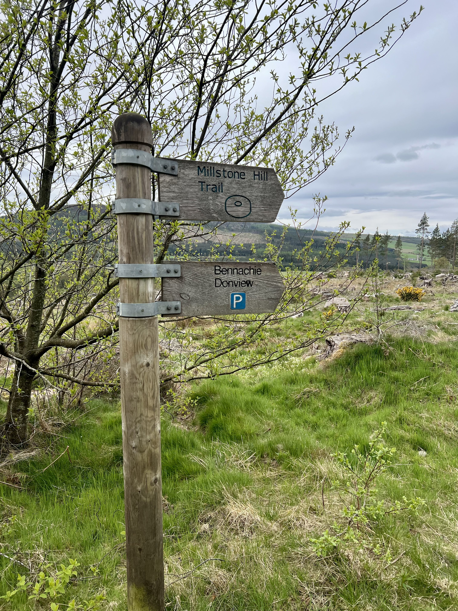

It’s been a [while since](https://gm5alx.uk/sota/2024/gm-es-077/) I’ve been here, and I remember liking it, so instead of spending ages in the car driving somewhere for a new hill, I thought I’d do a local one and then have some time at home as well.

 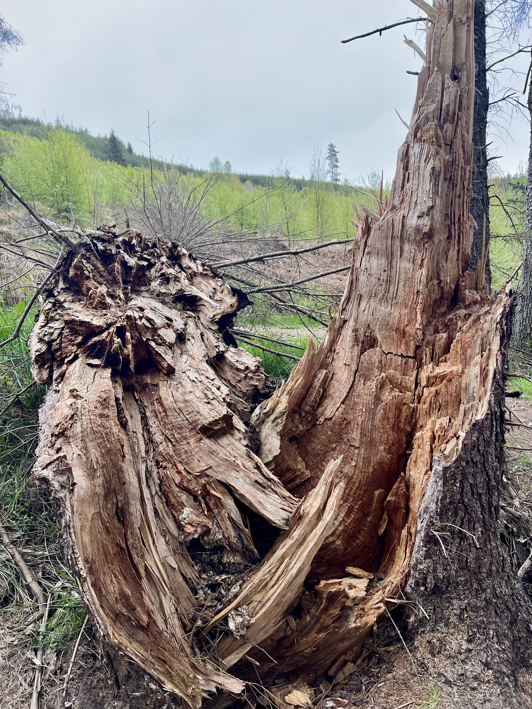
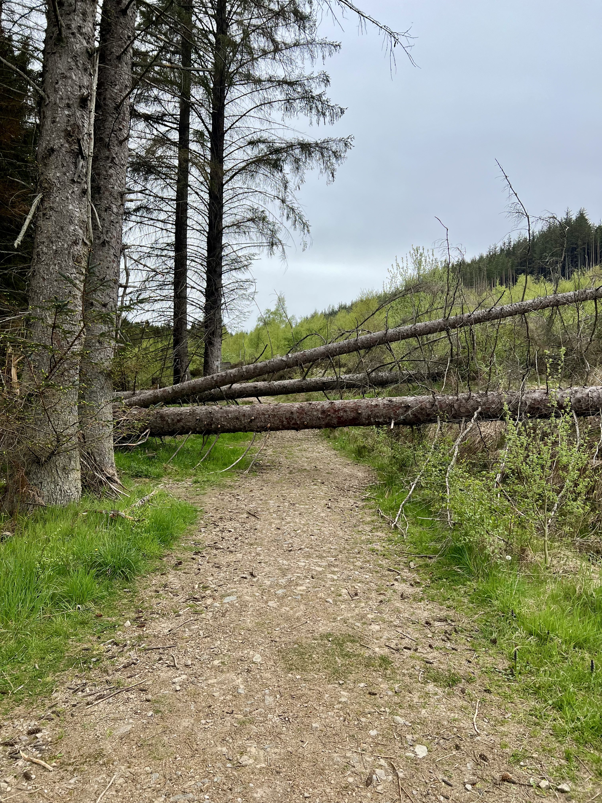

This time I was on my own and so could spend longer on the radio. It’s a nice walk up through the forest, plenty of birds and interesting things to look at. I remember last time, to encourage the kids to keep going we counted steps. It was hard not to start counting them myself! Even though it’s a small hill, you still have a decent amount of ascent, about 310m I think.

 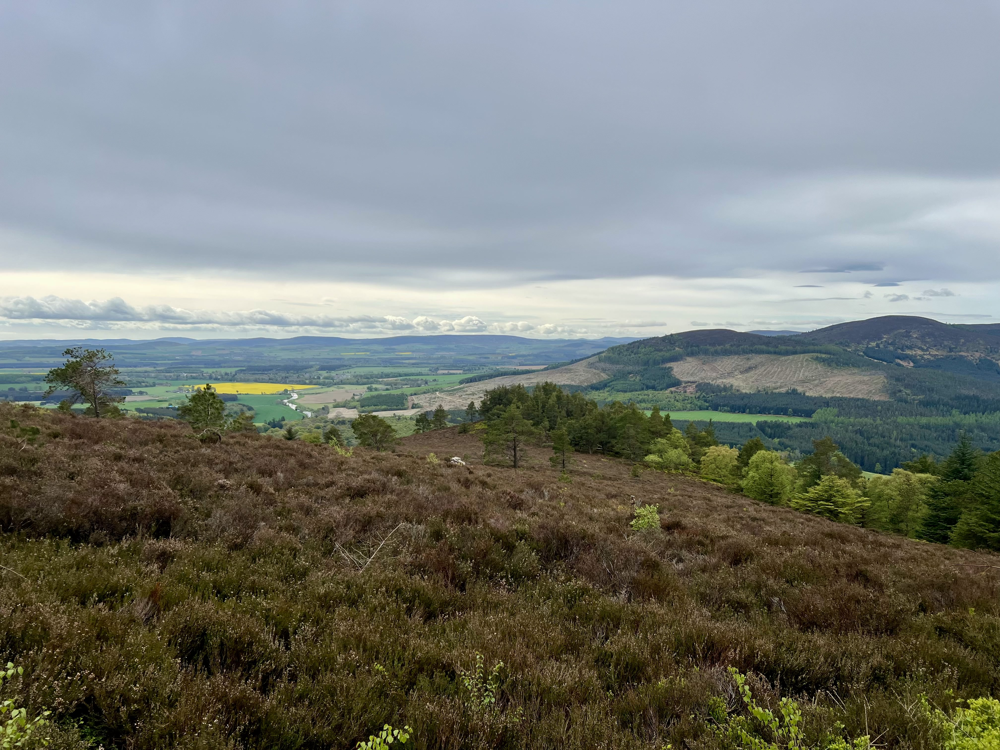
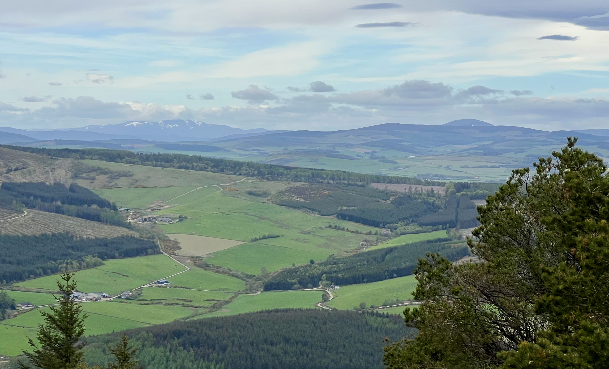
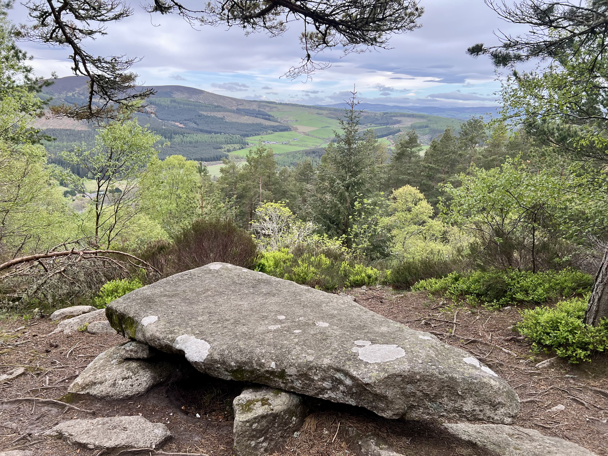

A local hill like this gets some other foot traffic, and a met a few people on my way. Made me think I need to setup away from the top, to not be annoying and not attract unnecessary attension!

 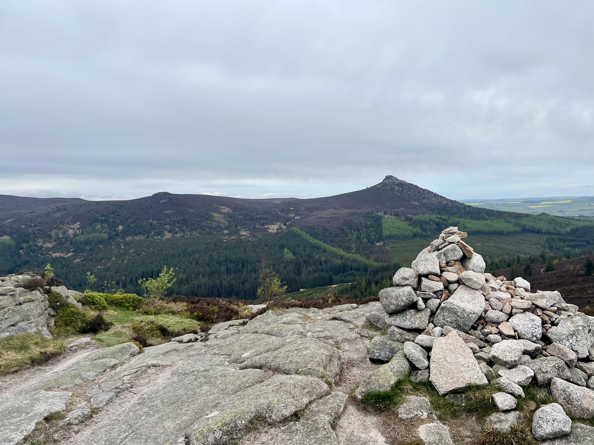

Weather was fine, nothing special but nice views and only a light breeze. I setup on a rock with the pole between my legs for the slim G to try 2m. A few folk were about, so a nice run of six on VHF. Peter, G5AIB, and his mum (also a ham) are up in the area for a holiday, so got both of them as they drove around.

 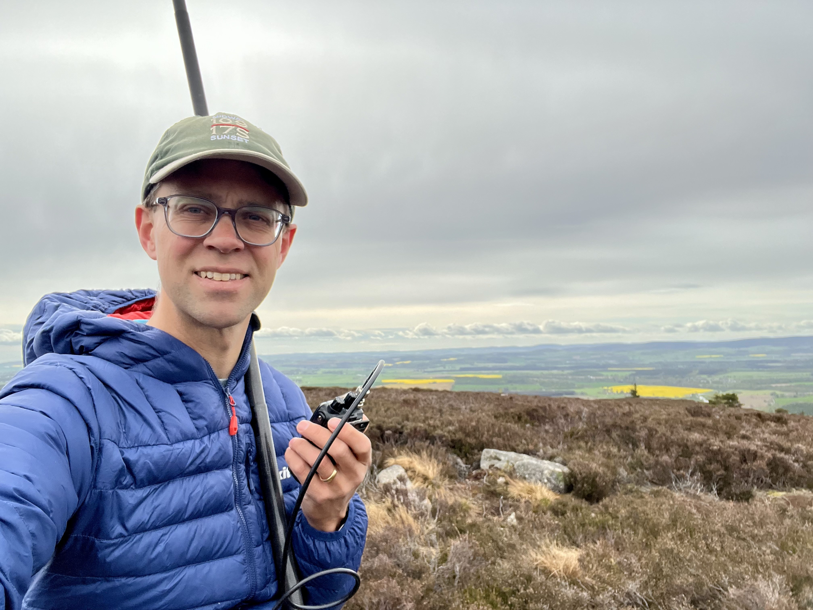

I setup HF by a tree - to support the mast - and found 40m was dire, and 20m was reasonable - a nice summit to summit with a Norwegian in Greece. 40m did improve a little, as I went back to it later. Mostly trying to get Jared, G5JFJ, who was on a tiny island off Mull (another island) on the west coast. I couldn’t really hear Jared but several G stations working him.

 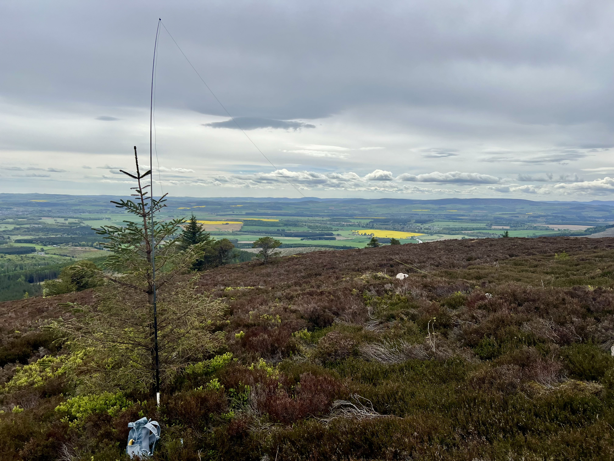

This time I did the loop around, and came back the other way. Pretty much the same time, and probably should’ve done that last time too. Forestry have been out and cleared some of the areas for logs, so some parts weren’t quite as nice to walk through anymore.

 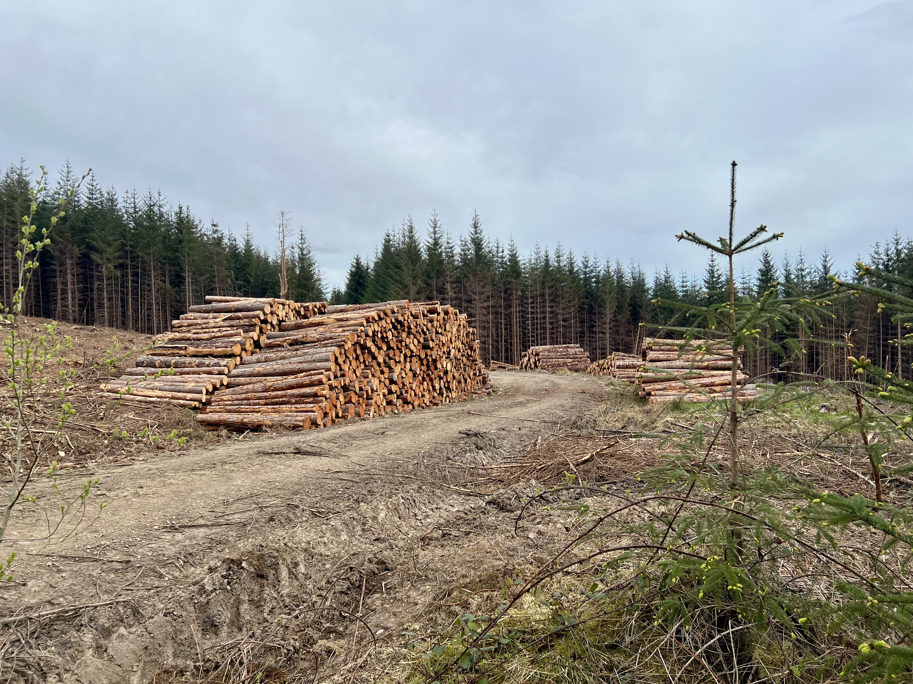
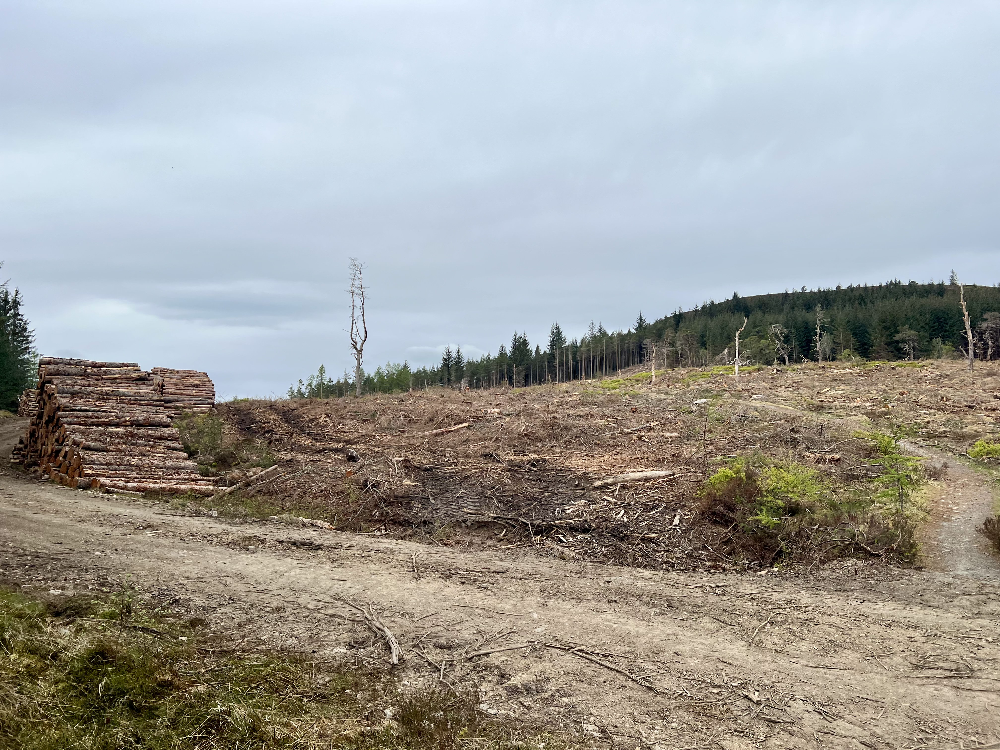

So only about 5.3 km today, and back home for lunch, but enjoyable nevertheless. Some nice fresh air, bit of a walk, and then plenty of time to play on the radio - if only the HF bands weren’t quite so bad! However, some nice local chats on 2m.

 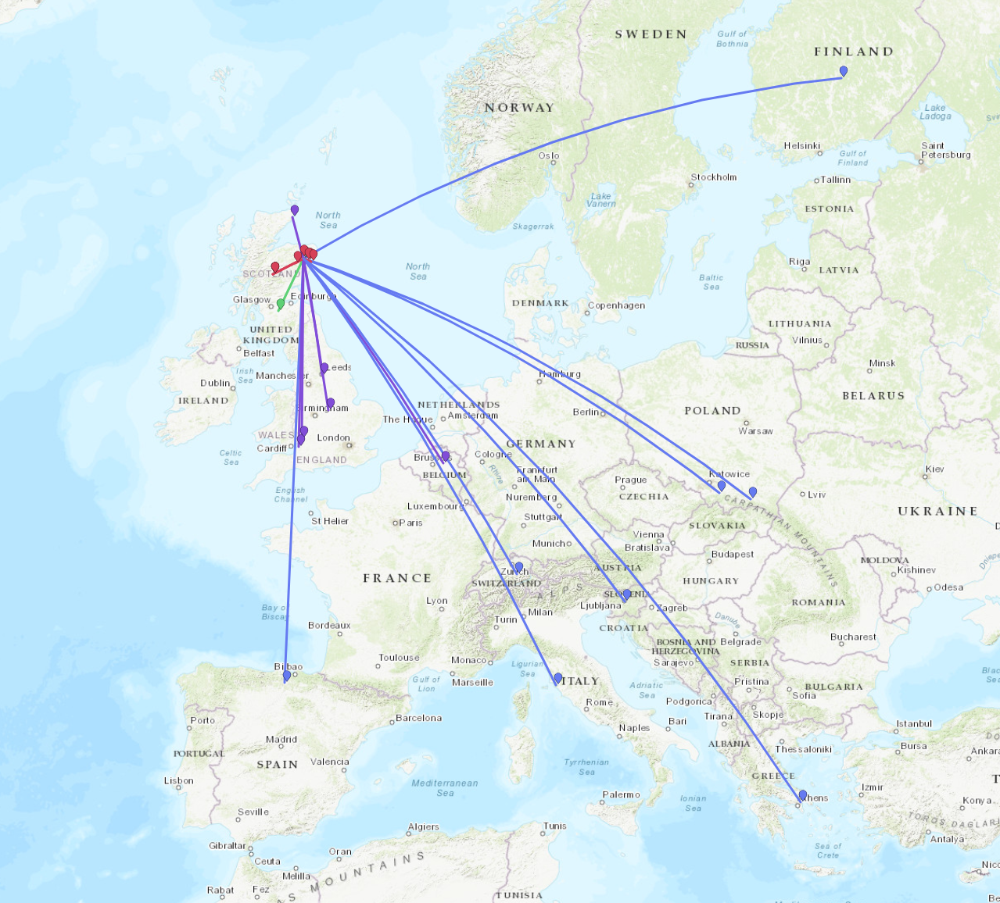

Next week I’m probably off to do a 40km, 12 hour day, for two big remote summits, which will be fun. However, this was a good reminder that the local “littlees” are still good days out.
