A couple of weeks ago I wanted to go out on my day off, but the forecast was for torrential rain across pretty much all of central and eastern Scotland. Looking at the radar simulation, it looked like going south to Ben Vorlich and Stuc a'Chroin would mean I’d just creep under the rain.

 

This would also be my first big outing in the new-to-me EV.In theory it should get there and back, as it said 333 miles at 100%, and the round trip total was 240. These two hills are a classic munro pair and the route is pretty standard. It’s a steady uphill the whole way, and soon the drizzle turned to rain, which continued until nearly the top.

 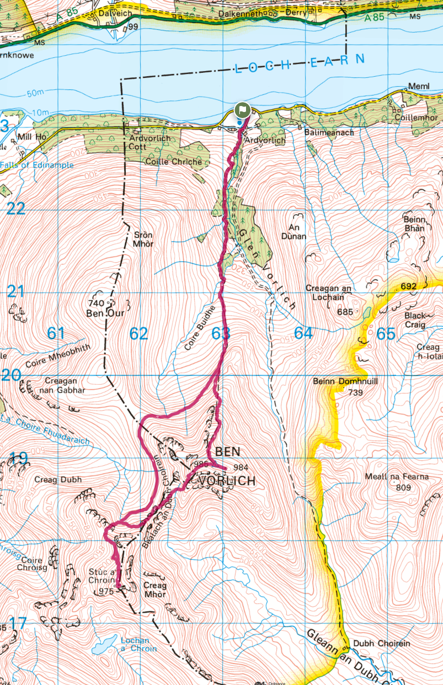
 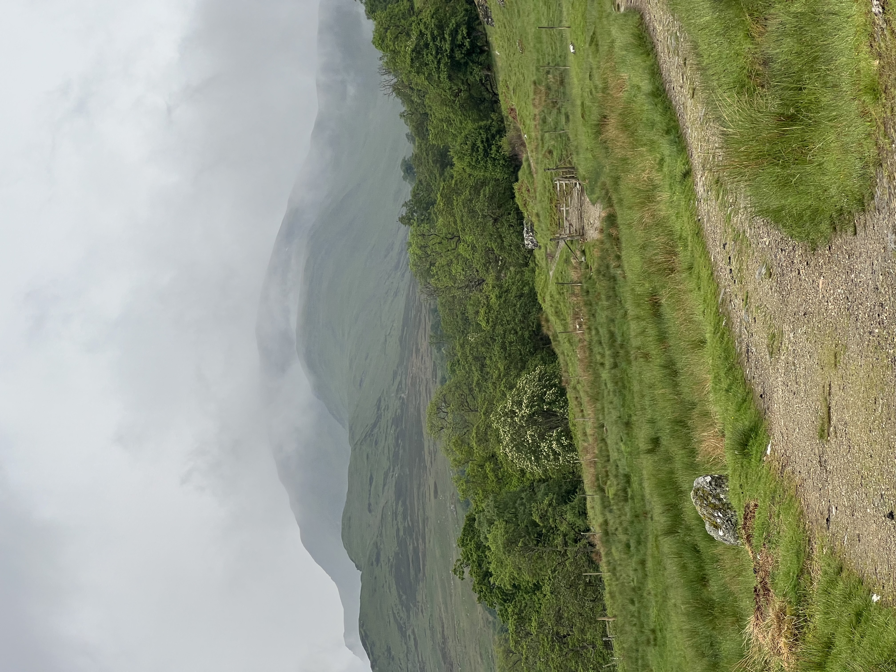

The top of Ben Vorlich isn’t that big, there is another cairn further along from the trig which offers nice views so could be hard to keep out the way. That, plus my desire to keep moving meant I just did 2m with HT and whip. In between calls the clouds did occasionally part and I’d get a glimpse of the views, and a small line of other walkers coming up.

 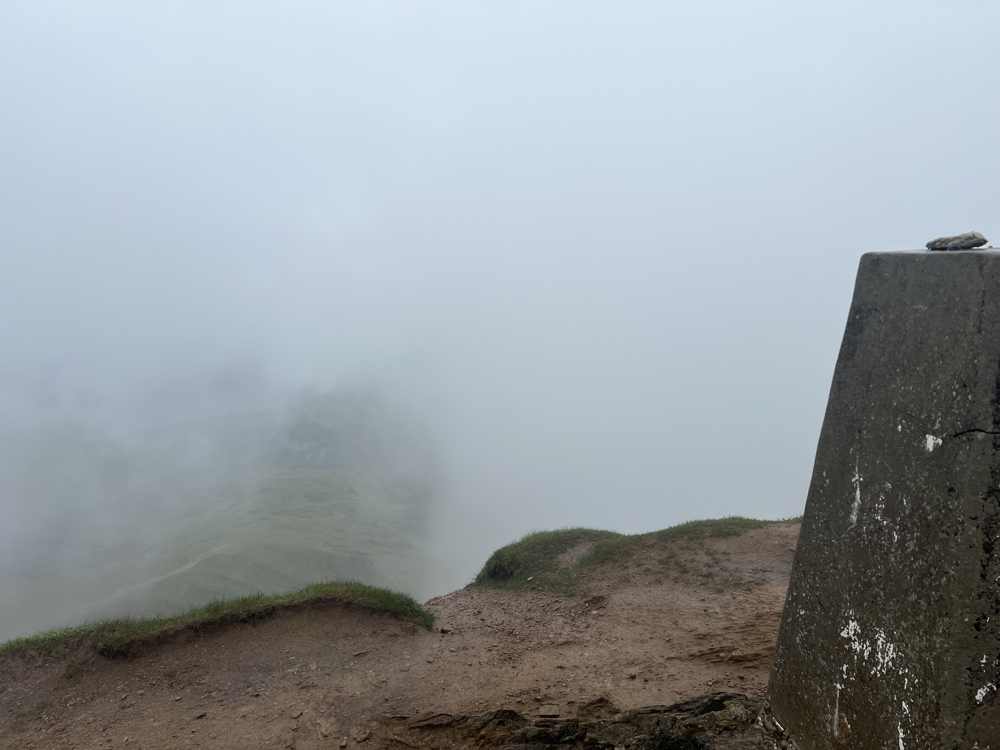
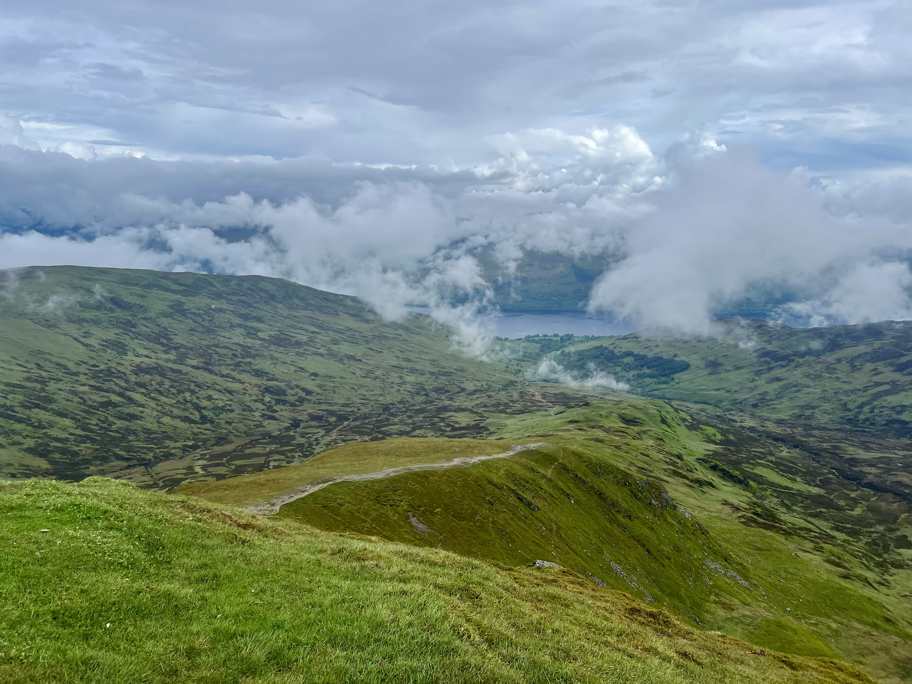
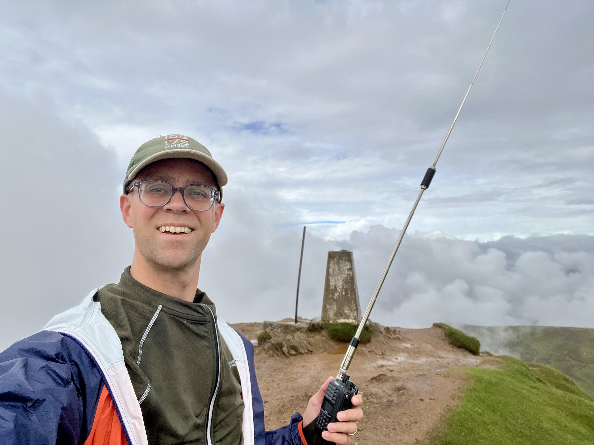
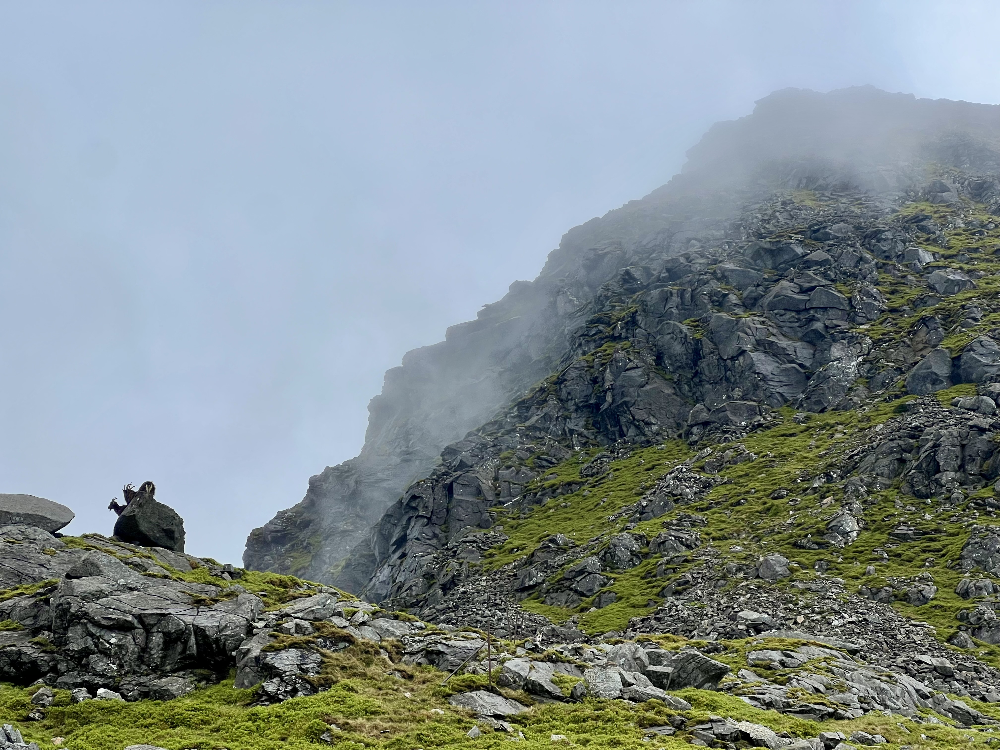
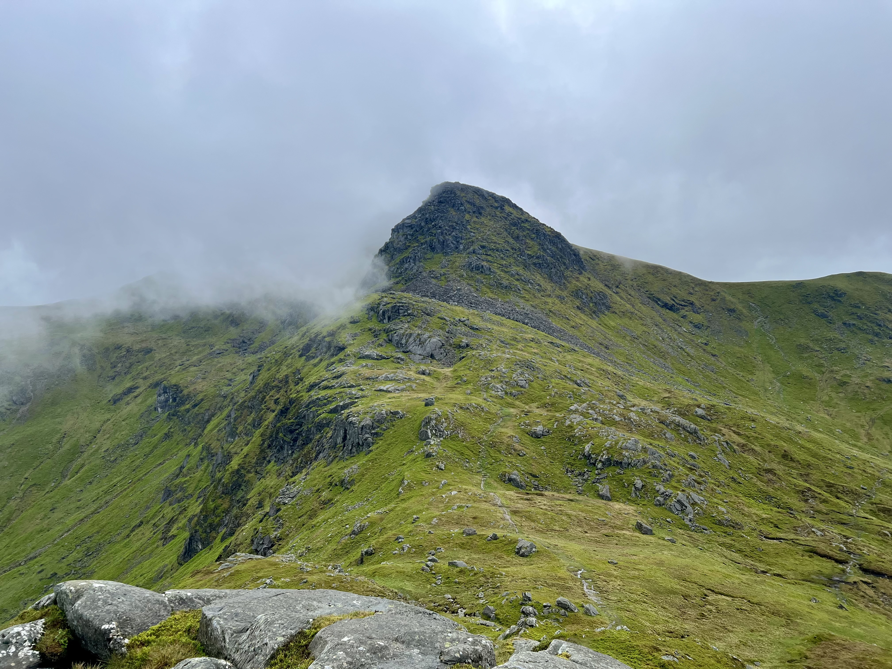
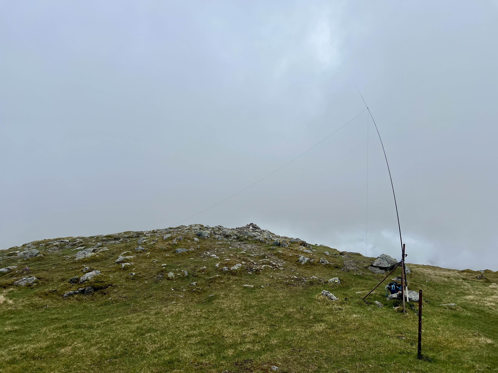

Off to the next one. Thankfully the rain had stopped, although I arrived at the top in the cloud. This time it was HF first. A bit slow and a mix of reports, but enough for 20 minutes of activity. As I swapped over to 2m, the clouds parted again and offered nice views of Ben Vorlich and the way I came.

 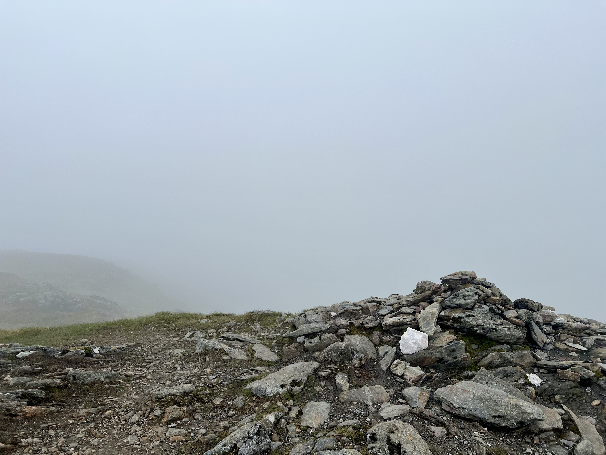
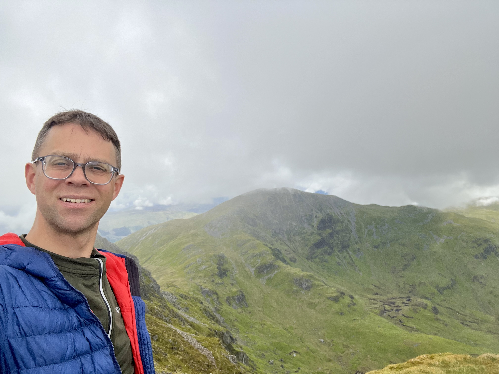

Whilst my first CQ on 2m brought in a few callers, I struggled as my transmissions kept cutting out. I didn’t notice until the other sidestarted talking over me, and suggesting my PTT needed pressing harder. It was only when I looked at the screen whilst transmitting that Irealised the HT was powering off and on again. It had said 2/3 bars when I started, but it went to zero on Tx. A few very abrupt, and intermittent (from my side) QSOs were made - I could say `SS` or `010` or `59` before it would restart. Definitely a test of patience for my chasers!

 

It’s a long walk back, and the side of Ben Vorlich is fairly boggy. Quite a few others were just starting out and heading up as I was nearly back at the road.

 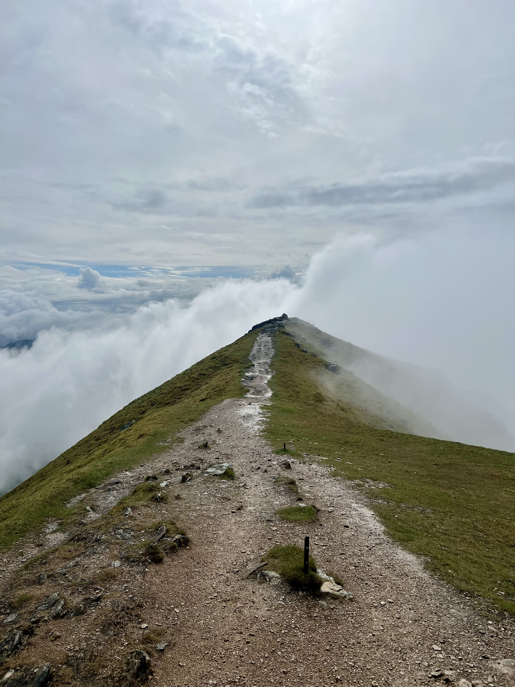

The roads back to the A9 were very flooded, and I had several 10 minutes of absolutely torrential rain. Where I realised I could’ve had a verywet walk! Arriving home with 15% remaining made me glad for the improved battery estimation of the car compared to the HT!
