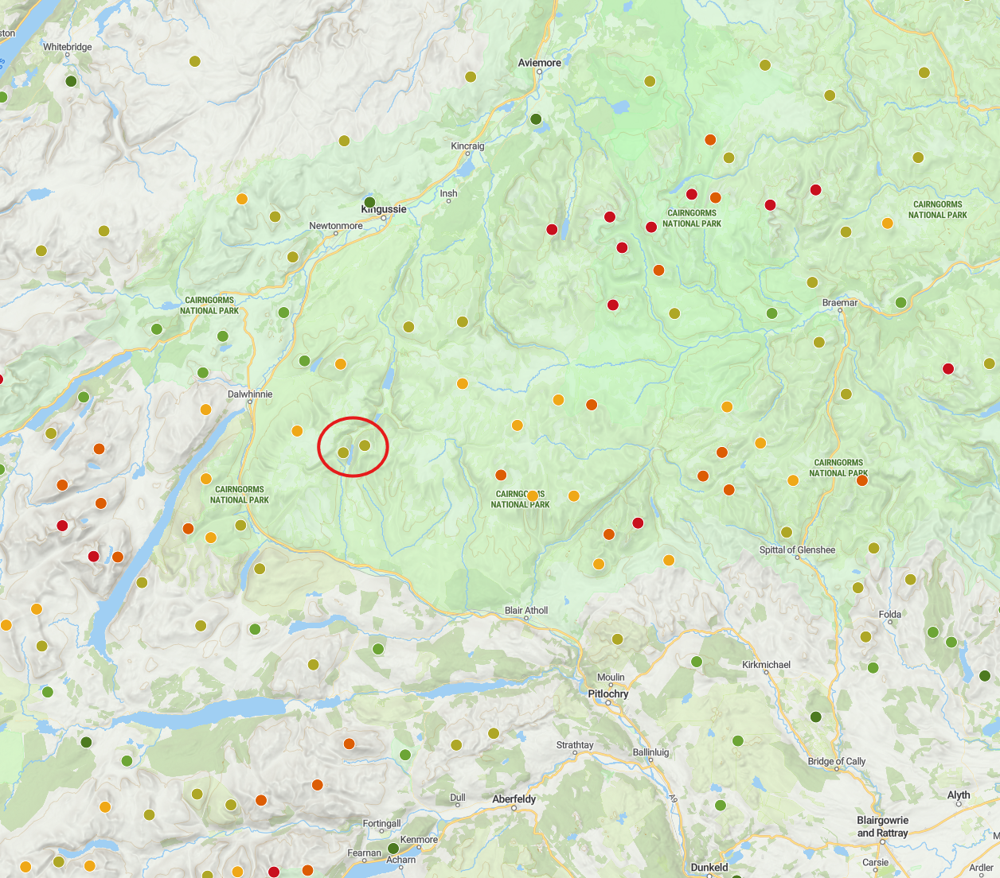
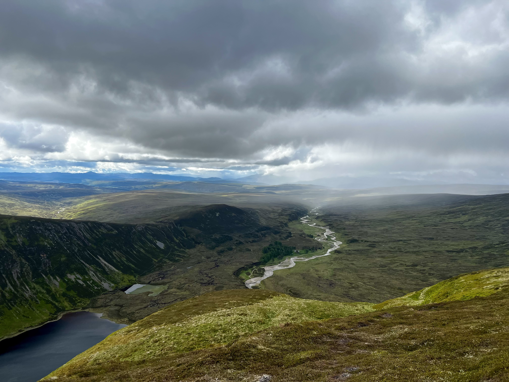
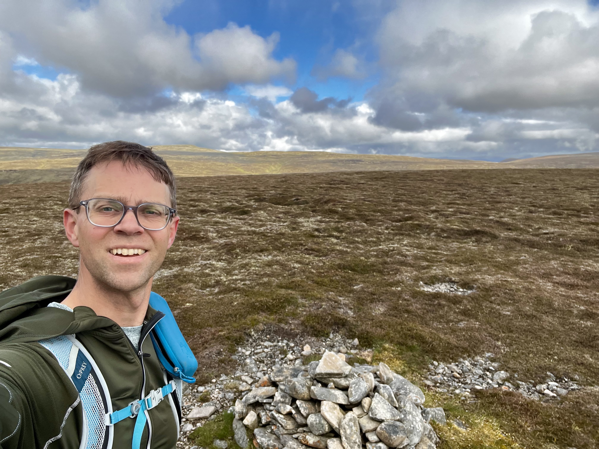
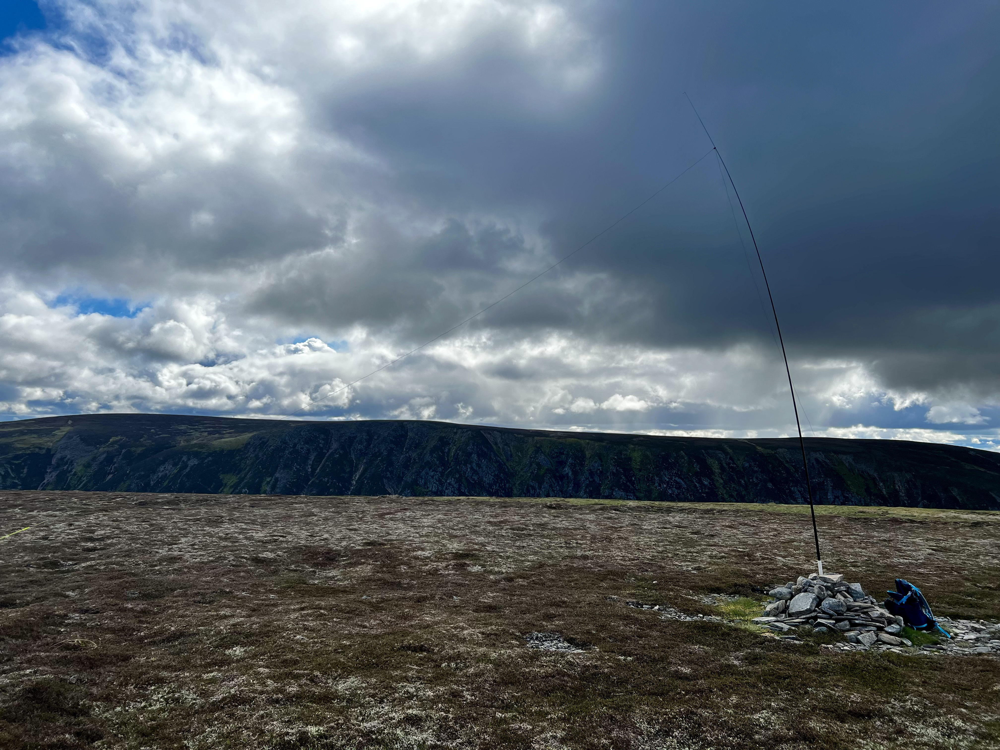
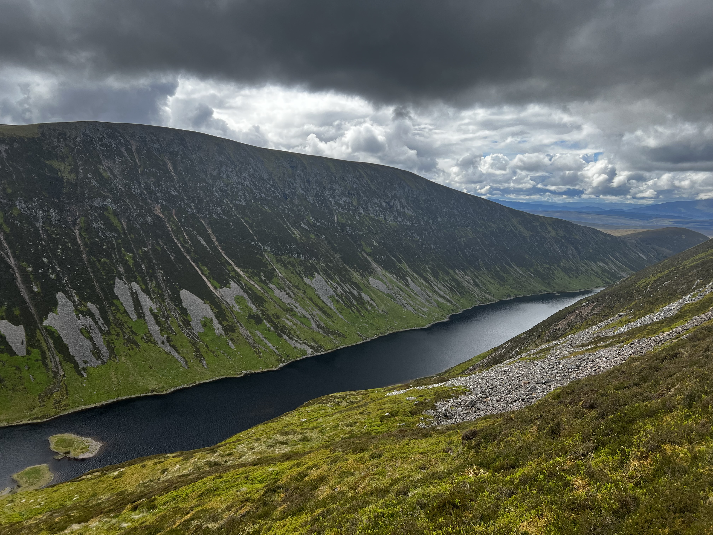
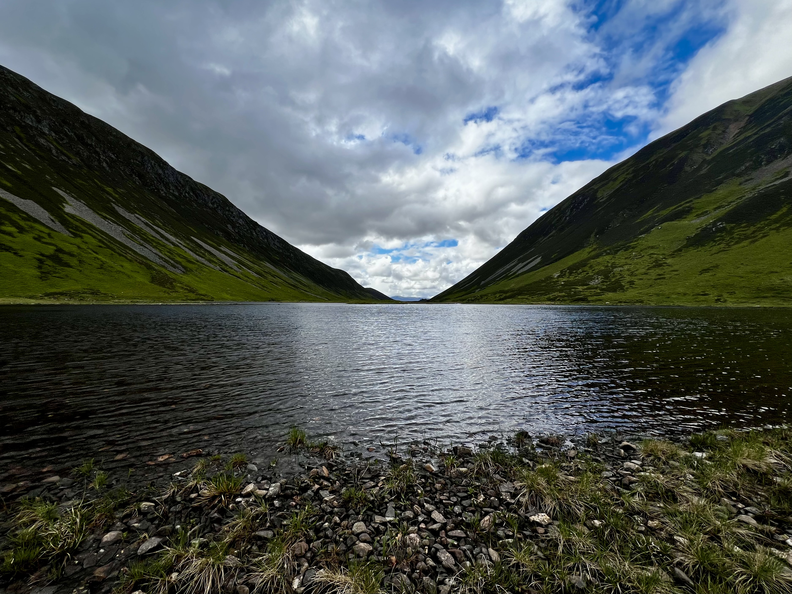
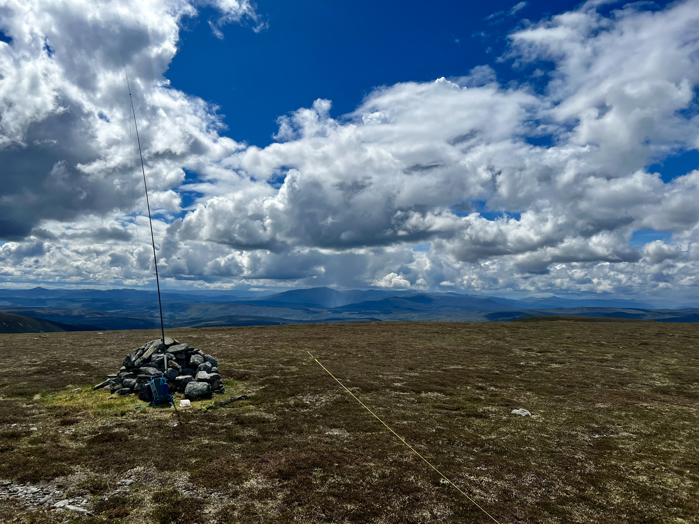
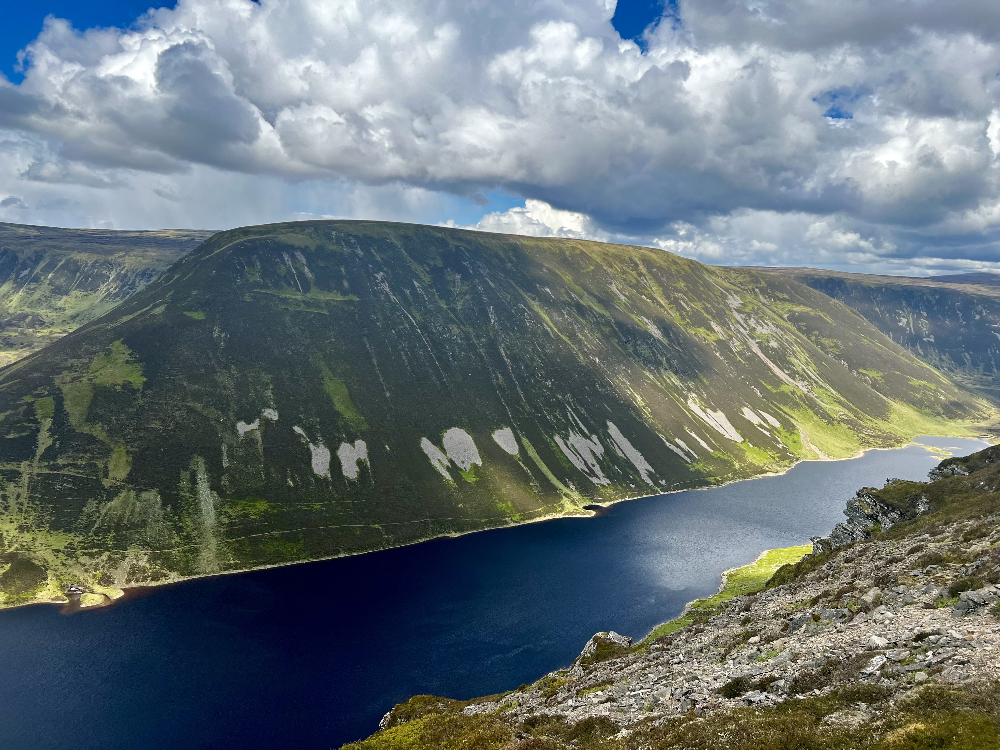
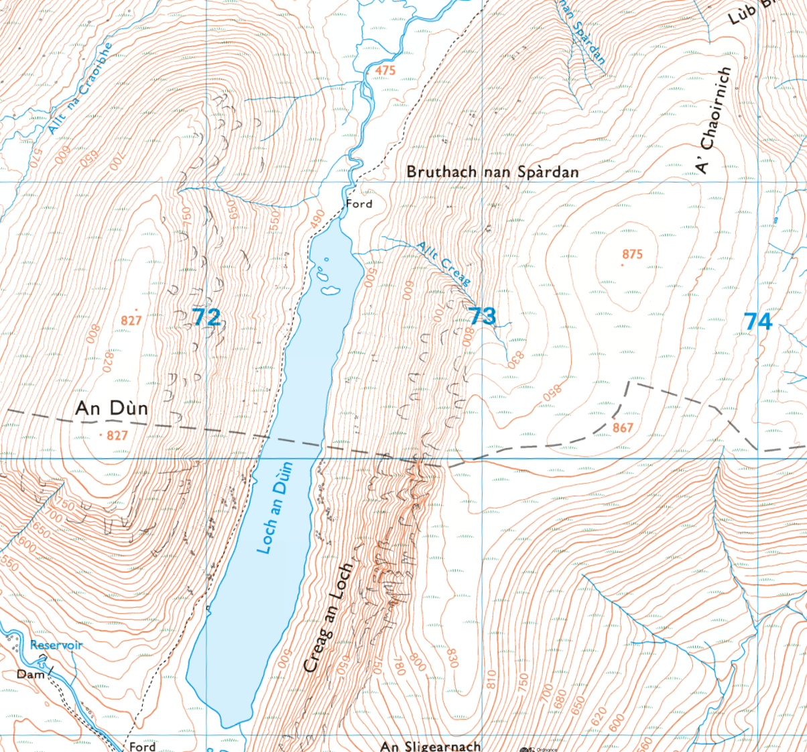

Out again today, this time doing A Dun and A'Chaoirnich - also known as the Gaick Corbetts. They’re a bit of a cycle in front of the A9, and then they are both very steep ascents and descents. Also what makes them interesting is that they have very large flat tops. Like two loaves of bread either side of a loch.

 

 

As you can see the two hills are quite similar and almost mirror images. Although A'Chaoirnich is 875m vs. An Dun of 827m. Both are quite tiring to climb as the sides are very steep! Check out the contours!

 

I was pretty lucky with the weather, I was expecting showers, and I saw several go by, but nothing where I was.

The radio was good too. 40m on An Dun was very lively, less so on the second summit but plenty of contacts. I did have a summit to summit with a Latvian summit, which I was surprised to later learn that there are only three SOTA summits in Latvia.

Still more to go in the Cairngorms National Park, so will keep chipping away when I have the time.
